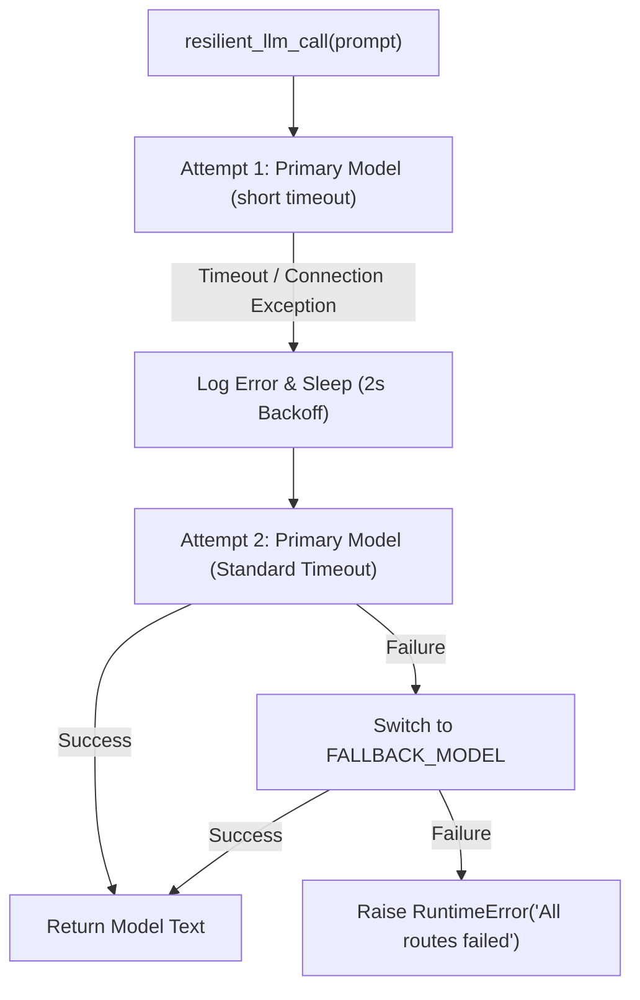

# Lab 4: Building a Resilient Gateway with Retries and Fallbacks

In this lab, you will implement `resilient_llm_call(prompt, max_retries=2)` to automatically recover from simulated timeouts and connection drops using exponential backoff retries and fallback model routes.

---

## What you touch
- Script: `lab4_resilient_gateway.py`
- Functions: `execute_llm_request(model_name, prompt, timeout_seconds)` and `resilient_llm_call(prompt, max_retries=2)`
- Models Configured: `PRIMARY_MODEL` and `FALLBACK_MODEL`
- Retry & Backoff Configuration: Exponential delay (`2 ** attempt` seconds) on transient failures

---

## Steps


1. Read `OLLAMA_HOST` and `OLLAMA_MODEL` from environment variables, defaulting to `http://127.0.0.1:11434` and `llama3.2:1b`.
2. Define `execute_llm_request(model_name, prompt, timeout_seconds)` to send an HTTP POST request to `{OLLAMA_HOST}/api/generate` with a specified socket timeout.
3. Define `resilient_llm_call(prompt, max_retries=2)`:
   - Loop `attempt` from 1 to `max_retries`.
   - On attempt 1, use a very short timeout (`timeout_seconds=0.001`) to simulate a transient network timeout.
   - Catch `URLError`, `TimeoutError`, and general exceptions.
   - Sleep for `2 ** attempt` seconds (exponential backoff) before retrying with a standard 15-second timeout on attempt 2.
   - If all primary retries fail, attempt the request against `FALLBACK_MODEL`.
   - If fallback fails, raise a descriptive `RuntimeError`.
4. Test the gateway in `__main__` with:
   `"Explain in 1 sentence why retry logic is critical for software APIs."`
5. Print the returned text and total duration.

---

## Data contract

**Low-Level POST Payload**

```json
{
  "model": "llama3.2:1b",
  "prompt": "Explain in 1 sentence why retry logic is critical for software APIs.",
  "stream": false,
  "options": { "temperature": 0.0 }
}
```

**Gateway Execution Parameters**

```json
{
  "max_retries": 2,
  "backoff_seconds": 2,
  "primary_model": "llama3.2:1b",
  "fallback_model": "llama3.2:1b"
}
```

---

## Run
From the repository root, run:

```bash
python education/06_the_reliability/lab4_resilient_gateway.py
```

```powershell
python education/06_the_reliability/lab4_resilient_gateway.py
```

---

## What you should see
1. `[Attempt 1/2]` failing due to the simulated short timeout.
2. An exponential backoff notification: `Retrying in 2 seconds...`.
3. `[Attempt 2/2]` succeeding on the primary route and printing the generated explanation.

---

## Stop here
You now have robust network reliability! In Chapter 07, we will explore state persistence and saving conversation histories to disk.

Next up: [Chapter 07: The State](../07_the_state/00_save_the_messages.md).

---

## Notes
*(Record your gateway retry execution trace here)*

