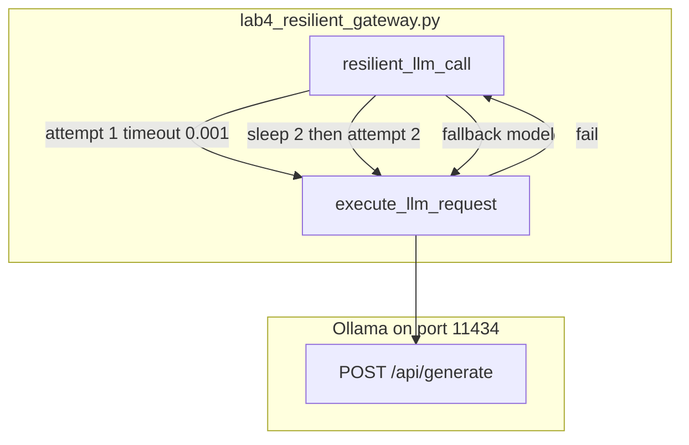

# Lab 4: Resilient gateway

A forced failure retried and then succeeded or raised.

## What you touch
- Script: `lab4_resilient_gateway.py`
- Function: `execute_llm_request(model_name, prompt, timeout_seconds)` POSTs `/api/generate`
- Function: `resilient_llm_call(prompt, max_retries=2)`
- URL literal: `http://192.168.1.29:11434/api/generate`
- `PRIMARY_MODEL`: `qwen3.6:35b-a3b-65k`
- `FALLBACK_MODEL`: `qwen3.6:35b-a3b`
- Request keys: `model`, `prompt`, `stream` false, `options.temperature` 0.0
- Response key: `response`
- Attempt 1 timeout: `0.001` seconds (forced fail). Attempt 2 timeout: `15.0`. Fallback timeout: `30.0`
- Backoff: `time.sleep(2 ** attempt)` after a fail if `attempt < max_retries`
- Prompt in `__main__`: `Explain in 1 sentence why retry logic is critical for software APIs.`
- Env defaults (this script does not read them): `OLLAMA_HOST` `http://192.168.1.29:11434`, `OLLAMA_MODEL` `qwen3.6:35b-a3b-65k`

## Steps


1. Write `execute_llm_request`. POST the generate body to `OLLAMA_URL`. Return `data["response"].strip()`.
2. Write `resilient_llm_call`. Loop `attempt` from 1 to `max_retries`. Print `[Attempt {attempt}/{max_retries}]`.
3. On attempt 1 use `timeout_seconds=0.001`. On later attempts use `15.0`. Catch `URLError`, `TimeoutError`, and `Exception`.
4. After a fail, if `attempt < max_retries`, sleep `2 ** attempt` seconds and retry the primary model.
5. After the budget, POST `FALLBACK_MODEL` with `timeout_seconds=30.0`. On that fail, raise `RuntimeError`.
6. Print the final text and the total duration. Do not add a circuit-breaker library or a second host URL.

## Data contract
Intended: retry on 429, 5xx, or connection drop, then raise or switch host. The reference script uses a tiny timeout and a second model name (Notes).

**Inner POST** `POST /api/generate`

```json
{
  "model": "qwen3.6:35b-a3b-65k",
  "prompt": "string",
  "stream": false,
  "options": { "temperature": 0.0 }
}
```

**Wrapper knobs**

```json
{
  "max_retries": 2,
  "backoff_seconds": 2,
  "primary_model": "qwen3.6:35b-a3b-65k",
  "fallback_model": "qwen3.6:35b-a3b"
}
```

Return value is the `response` string.

## Run
Copy `.env.example` to `.env` in the repo root and uncomment the Ollama lines. The script loads that file (it does not override vars already set in the shell).

From the repo root:

```bash
python education/06_the_reliability/lab4_resilient_gateway.py
```

```powershell
python education/06_the_reliability/lab4_resilient_gateway.py
```

Ollama must be up on port `11434`. Expect about 2 seconds of backoff after attempt 1.

## What you should see
`Starting Resilient LLM Gateway Lab 3...` then `--- ATTEMPTING PRIMARY ROUTE (qwen3.6:35b-a3b-65k) ---`. `[Attempt 1/2]` fails (timeout). Then `Retrying in 2 seconds`. `[Attempt 2/2]` usually prints `Primary route succeeded!` and `=== FINAL EXECUTED RESULT ===` plus one sentence and a duration. If attempt 2 also fails, you see `TRIGGERING FALLBACK` and either fallback text or `RuntimeError: All routes failed`. If attempt 1 succeeds, the 0.001 timeout did not fire (rare on a very fast LAN).

## Stop here
Do not add jitter, a circuit-breaker library, LiteLLM, or multi-region balancing. Next: [lab1_cot_demuxer.md](../06_the_reliability/lab1_cot_demuxer.md).

## Notes
- Keep the 0.001s first timeout, `max_retries=2`, backoff `2 ** attempt`, and the fallback model name.
- Contract drift vs `lab4_resilient_gateway.py`: no `OLLAMA_HOST` / `OLLAMA_MODEL` read. No 429/5xx branch (any exception retries). No jitter. No circuit breaker. No second host (same URL, different `model`). Fallback tag `qwen3.6:35b-a3b` may 404 if it is not pulled. The intended contract is retry on 429/5xx/connection with backoff, then raise or switch host. Write that in your copy. Do not edit the `.py` in the repo.
- Chapter 15 can call `resilient_llm_call` from the harness.
