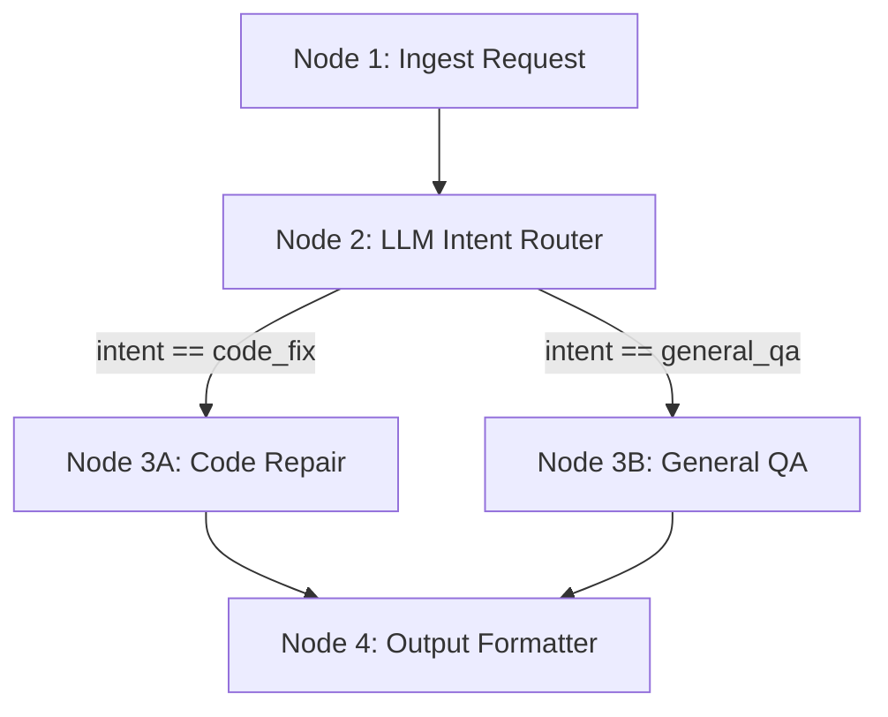

# 06: Deterministic DAGs

After this page you pass a dict through named functions in a fixed order. One node may call the model to pick a branch. That is a DAG.

## Data
- State: a `dict` passed `state = node(state)`
- Nodes: `node_ingest_request`, `node_route_intent`, `node_worker_code_fix` / `node_worker_general_qa`, `node_format_output`
- Router output keys: `intent` (`code_fix` | `general_qa`), `confidence` (0–1)
- Fallback: on parse/HTTP error, `intent = "general_qa"`

## Information
A ReAct loop can skip or reorder steps. A DAG cannot. Deterministic nodes do ingest and format. The LLM sits only at the ambiguous junction.

## Knowledge
1. Ingest into a dict.
2. Router node POSTs and `json.loads` an intent.
3. `if intent == "code_fix"` else the other worker.
4. Format a final payload.

## Wisdom
Use a DAG when the sequence must be audited. Use the chapter 04 loop when the next step is unknown.

## The When and Why
- **When:** the steps must happen in a fixed order (ingest → classify → process → format).
- **Why:** a free loop can skip a required step. A DAG names the order.

## How it works



## Data contract
**Router JSON**

```json
{ "intent": "code_fix", "confidence": 0.98 }
```

**Final payload**

```json
{ "status": "COMPLETED", "processed_intent": "code_fix", "result": "string", "pipeline_duration_seconds": 0 }
```

## Lab
- [lab1_dag_pipeline.py](./lab1_dag_pipeline.py) / [lab1_dag_pipeline.md](./lab1_dag_pipeline.md) — Done when a code-fix prompt takes the code_fix branch and prints a completed payload.

## Related
- **Airflow / Prefect:** same topological run, heavier runtime.
- **Hardcoded if/else:** $0 and <1ms. Use it when the branch is not ambiguous.

## Notes
- If the model wraps JSON in fences, strip fences before `json.loads`. On failure the lab falls back to `general_qa`.
