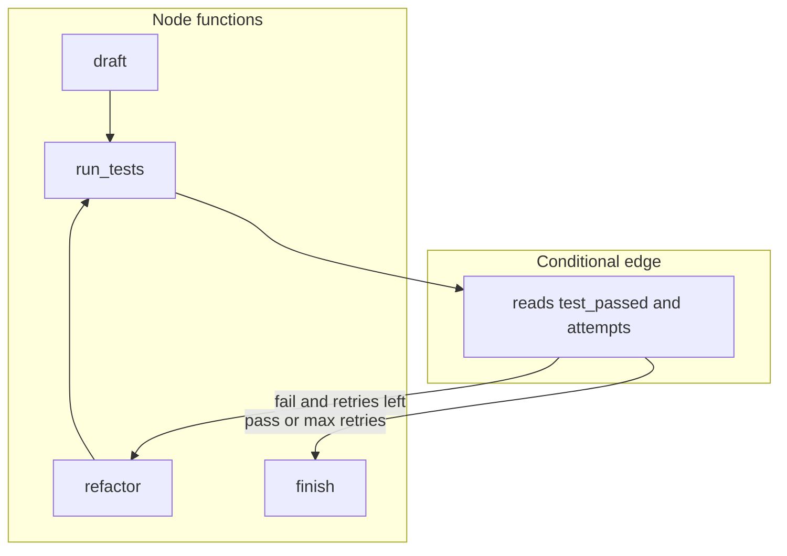

# 06: Graph workflows

After this page a state dict can loop: draft, then test, then refactor, then test again. Edges are functions that return the next node name. Checkpoints are chapter 05. This page does not require SQLite.

## Data
The last page was a DAG: arrows go forward only. This page adds a **back edge**. A back edge is an arrow from a later node to an earlier one. Draft to test is forward. Test to refactor to test is a cycle.

**Graph state** is a shared dict. The example keys are the same as chapter 05: `code` (string), `attempts` (int), `test_passed` (bool).

**Nodes** are functions `dict -> dict`. They update keys and return the dict. They do not choose the next node.

A **conditional edge** is a function that reads the dict and returns a string node name, for example `"refactor"` or `"finish"`. The runner calls that function after a node and jumps to the named node.

A **cycle** is allowed here. A DAG forbids it. Cap the loop with `max_retries` (chapter 05 uses 3) so `attempts` cannot grow forever.

There is no `lab2_graph_workflow.py` in this folder. The checkpointer script in chapter 05 (`lab2_state_checkpointer.py`) is this graph plus SQLite. This page is the edge and loop, not the INSERT.

## Information
A DAG has no back edge. A graph does. After `node_run_tests`, Python reads `test_passed` and `attempts`. If the test failed and retries remain, the next name is `refactor`. If the test passed or `attempts` hit the cap, the next name is `finish`.

LangGraph and XState are libraries around this same picture: a dict, node functions, and edge functions that return a name. Human-in-the-loop interrupts and time-travel forks are later chapters. Do not add them here.

The model is optional. The chapter 05 nodes never POST. A later graph can put a model call inside one node. The new idea on this page is the named edge, not the POST.

## Knowledge
1. Define nodes that update a dict (`draft`, `run_tests`, `refactor`).
2. After a node, call an edge function. It returns a string: `"run_tests"`, `"refactor"`, or `"finish"`.
3. Loop until the edge returns `"finish"` or `attempts` reaches `max_retries`.
4. Optionally call `save_checkpoint` after each node (chapter 05). That is not required to understand the edge.
5. Do not add Temporal, Postgres locking, or a second process.

## Wisdom
A graph is for retry and repair. A DAG is for one-pass pipelines. If the steps never need to run again, stay on the last page. Temporal, Redis locks, and human approval gates are not this page. Adding them now hides whether the edge function or the lock is what broke the loop.

## The When and Why
- **When:** a step must run again after a failure (test, then refactor, then test).
- **Why:** an acyclic list cannot express that loop without a second script. The edge return value is how the runner knows to go back.

## How it works



Walkthrough of the chapter 05 example (same dict, ignore SQLite):

1. `draft` writes a one-line `calculate_total` into `code` and sets `test_passed` to false.
2. `run_tests` increments `attempts`. On attempt 1 it sets `test_passed` false.
3. The edge reads those keys and returns `"refactor"`.
4. `refactor` replaces `code` with a version that checks `price < 0`.
5. `run_tests` runs again. Attempt 2 sets `test_passed` true.
6. The edge returns `"finish"`. The runner stops.

The new control is the string the edge returns. The dict is the same object the whole time.

## Data contract

**State dict**

```json
{ "code": "string", "attempts": 0, "test_passed": false }
```

**Edge return:** a string node name, for example `"refactor"` or `"finish"`. Not a URL. Not a JSON object.

**Node signature:** `def node(state: dict) -> dict`.

## Lab
This folder has no lab 2. The idea is still required: a DAG cannot retry.

- Module: [this file](./01_graph_workflows.md)
- Closest run: [../05_the_state/lab2_state_checkpointer.py](../05_the_state/lab2_state_checkpointer.py) is this graph plus SQLite. Read the `while state["attempts"] < max_retries` block as the edge.
- Missing brief: [STUB_lab2_graph_workflow.md](./STUB_lab2_graph_workflow.md) after it is added.
- Previous page: [00_deterministic_dags.md](./00_deterministic_dags.md) (no back edge).

## Related
- **LangGraph:** nodes, reducers, checkpointers as classes. Same dict plus edge names.
- **XState:** same finite-state job in JavaScript.
- **Chapter 05 checkpointer:** this loop with an INSERT after each node.

## Notes
- There is no `lab2_graph_workflow.py`. Do not expect a Run block on this page.
- HITL interrupts and time-travel forks are later. Do not add them here.
