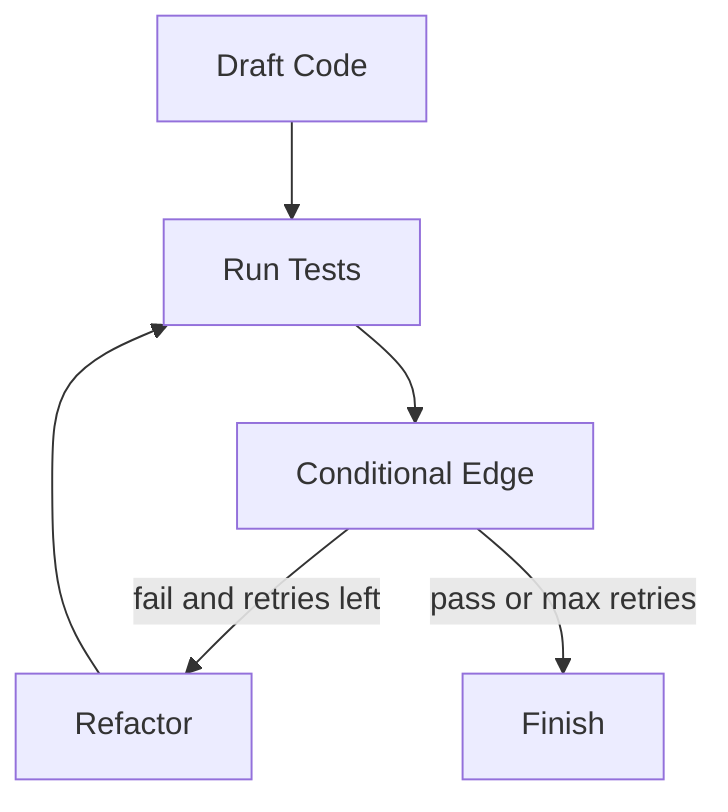

# 06: Graph workflows

After this page a state dict can loop: draft → test → refactor → test. Edges are functions that return the next node name. Checkpoints are chapter 05.

## Data
- Graph state: a shared dict (`code`, `attempts`, `test_passed`)
- Nodes: functions `dict -> dict`
- Conditional edge: a function that reads state and returns a node name
- Cycle: allowed here (unlike a DAG). Recursion cap: `max_retries`

## Information
A DAG has no back edge. A graph does. LangGraph/XState are libraries around this same dict + node + edge picture. HITL interrupts and time-travel forks are later chapters.

## Knowledge
1. Define nodes that update a dict.
2. After a node, evaluate an edge.
3. Loop until pass or max retries.
4. Optionally save after each node (chapter 05).

## Wisdom
A graph is for retry/repair. A DAG is for one-pass pipelines. Do not add Temporal or Postgres locking here.

## The When and Why
- **When:** a step must run again after a failure (test → refactor → test).
- **Why:** an acyclic list cannot express that loop without a second script.

## How it works

## Data contract
**Edge return:** a string node name, e.g. `"refactor"` or `"finish"`.

## Lab
The checkpointer lab in chapter 05 is this graph plus SQLite. This page is the edge/loop idea.

## Related
- **LangGraph:** nodes, reducers, checkpointers as classes.
- **XState:** same FSM job in JS.

## Notes
Leave empty until you run a graph lab.
