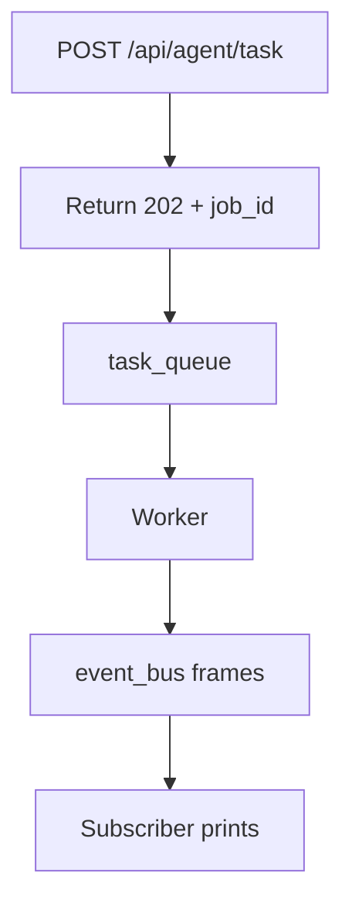

# 06: Event-driven async

After this page a submit function returns immediately (HTTP 202 + `job_id`) and a worker reads an `asyncio.Queue`. Long model calls do not hold the request thread.

## Data
- `task_queue = asyncio.Queue()`
- `event_bus = asyncio.Queue()`
- Events: `{event_type, job_id, timestamp, data}` with types `job.started`, `agent.thought`, `agent.completed`, `agent.failed`
- Submit return: `{status_code: 202, job_id, status_url}`

## Information
Synchronous HTTP waits for the model. Gateways cut that wait at 30–60s (504). Enqueue, return 202, let a worker POST to Ollama, emit events. FastAPI/SSE in chapter 10 is this queue with a real socket.

## Knowledge
1. Start a worker task and a subscriber task.
2. `api_submit_task` puts a job and returns 202.
3. Worker `get()`, emits events, runs the POST in an executor.
4. Subscriber prints event frames.

## Wisdom
An in-process `asyncio.Queue` is enough to prove 202 + events. Redis/Kafka/Celery are the same contract on more machines.

## The When and Why
- **When:** a model call can exceed the HTTP timeout.
- **Why:** holding the request open starves workers and dies at the gateway.

## How it works



## Data contract
**Event frame**

```json
{ "event_type": "agent.completed", "job_id": "job_1", "timestamp": 0, "data": { "result": "string", "status": "SUCCESS" } }
```

## Lab
- [lab3_async_event_queue.py](./lab3_async_event_queue.py) / [lab3_async_event_queue.md](./lab3_async_event_queue.md) — Done when submit prints 202 in ~0s and later events include `agent.completed`.

## Related
- **Celery / BullMQ:** same queue, other process.
- **Redis Pub/Sub:** same event bus, networked.

## Notes
- 202 is the point: the web thread is free while the worker talks to Ollama.
