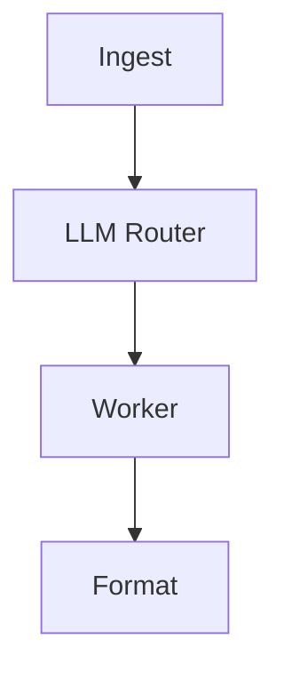

# Lab 1: DAG pipeline

After this lab a dict has gone ingest → router → worker → format, and the router used a JSON intent.

## Data
- Script: `lab1_dag_pipeline.py`
- URL: `{OLLAMA_HOST}/api/generate`
- Router keys: `intent`, `confidence`

## Information
Deterministic nodes wrap one model call at the branch.

## Knowledge
1. Ingest.
2. Route via JSON.
3. Branch.
4. Format and print.

## Wisdom
This is not ReAct. The order is hardcoded.

## The When and Why
- **When:** steps must stay in order.
- **Why:** this is the smallest router-DAG.

## How it works



## Data contract
See the module JSON shapes.

## Run
From the repo root:

```bash
python education/06_the_workflow/lab1_dag_pipeline.py
```

## What you should see
A completed payload with `processed_intent`. On bad JSON, fallback to `general_qa`.

## What this becomes later
Chapter 08 uses a similar branch between two agents.

## Related
- **Chapter 02:** the JSON parse this router uses.

## Notes
- Boundary: `parsed = json.loads(raw_text)` then `intent = parsed.get("intent", "general_qa")`. Exceptions fall back.
