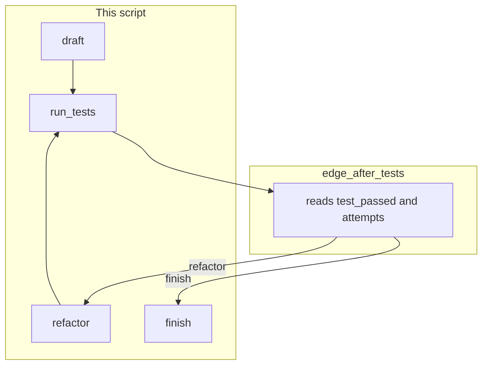

# Lab 2: Graph workflow

A runner calls named nodes until an edge function returns `"finish"`. Each node name and each edge return is printed.

## What you touch
- Script: `lab2_graph_workflow.py` (write it next to this brief; there is no reference `.py` yet)
- Nodes: `draft(state)`, `run_tests(state)`, `refactor(state)` each `dict -> dict`
- Edge: `edge_after_tests(state)` returns a string node name (`"refactor"` or `"finish"`)
- Runner: `run_graph(state, max_retries=3)` looks up the next name and calls that function
- State keys: `code` (string), `attempts` (int), `test_passed` (bool)
- No HTTP. This script does not read `OLLAMA_HOST` or `OLLAMA_MODEL`.
- No SQLite. No queue.

## Steps


1. Start `state = { "code": "", "attempts": 0, "test_passed": False }`.
2. Write `draft`. Set `code` to `def calculate_total(price, tax): return price + tax` and `test_passed` to false. Return the dict.
3. Write `run_tests`. Increment `attempts`. If `attempts < 2`, set `test_passed` false. Else set `test_passed` true. Return the dict.
4. Write `refactor`. Replace `code` with a version that raises `ValueError` when `price < 0`. Return the dict.
5. Write `edge_after_tests`. If `test_passed` is false and `attempts < max_retries`, return `"refactor"`. Else return `"finish"`. Do not call a node from this function.
6. Write `run_graph`. Keep a dict of names to functions: `draft`, `run_tests`, `refactor`. Start at `"draft"`. After `draft`, go to `"run_tests"`. After `run_tests`, call `edge_after_tests` and jump to that name. After `refactor`, go to `"run_tests"`. Stop when the edge returns `"finish"` or `attempts` hits `max_retries`. Print each node name you call and each edge return.
7. In `__main__`, call `run_graph` with the empty start dict. Do not open SQLite. Do not POST. Do not add a queue.

## Data contract
Only the keys this script writes and reads.

**State dict**

```json
{ "code": "string", "attempts": 0, "test_passed": false }
```

**Edge return:** a string, `"refactor"` or `"finish"`. Not a URL. Not a JSON object.

**Node signature:** `def node(state: dict) -> dict`.

## Run
From the repo root:

```bash
python education/06_the_workflow/lab2_graph_workflow.py
```

```powershell
$env:OLLAMA_HOST="http://192.168.1.29:11434"
$env:OLLAMA_MODEL="qwen3.6:35b-a3b-65k"
python education/06_the_workflow/lab2_graph_workflow.py
```

This script ignores `OLLAMA_HOST` and `OLLAMA_MODEL`. They are listed so the lab Run block matches the other chapters. There is no HTTP call.

## What you should see
`draft`, then `run_tests`, then edge `refactor`, then `refactor`, then `run_tests`, then edge `finish`. `attempts` is 2 and `test_passed` is true. If the script never returns to `run_tests`, the edge did not return a node name. If you see a SQLite path or a queue, you opened the wrong lab.

## Stop here
This is not a checkpointer. Do not add SQLite. Do not add a queue (that is lab 3). Do not POST to the model. Chapter 05 `lab2_state_checkpointer.py` is this graph plus INSERT. Human-approval gates are chapter 09.

## Notes
- Write `lab2_graph_workflow.py` next to this brief. There is no reference `.py` in the repo yet.
- Nodes update keys. The edge picks the next name. Do not put the branch inside `run_tests`.
- Keys written and read match this brief. Do not edit other `.py` files in the repo.
