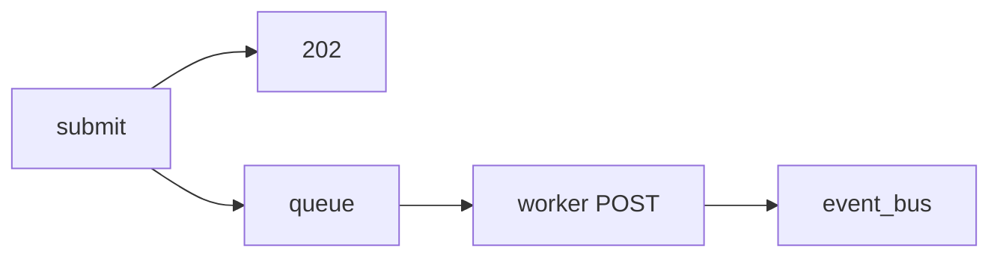

# Lab 3: Async event queue

After this lab a submit returns 202 immediately and a worker later emits `agent.completed`.

## Data
- Script: `lab3_async_event_queue.py`
- Queues: `task_queue`, `event_bus`
- Event types: `job.started`, `agent.thought`, `agent.completed`, `agent.failed`

## Information
Submit does not wait for Ollama. The worker does.

## Knowledge
1. Start worker + subscriber.
2. Submit a prompt; print 202 and `job_id`.
3. `await task_queue.join()`.

## Wisdom
This is not FastAPI. Chapter 10 puts 202 and SSE on a real port.

## The When and Why
- **When:** the model call is longer than an HTTP timeout.
- **Why:** this is the smallest 202 + queue + events script.

## How it works



## Data contract
**202 body:** `{ "status_code": 202, "job_id": "job_...", "status_url": "/api/jobs/..." }`

## Run
From the repo root:

```bash
python education/06_the_workflow/lab3_async_event_queue.py
```

## What you should see
A 202 line in ~0.00s, then stream events, then complete.

## What this becomes later
Chapter 10 serves these frames over SSE.

## Related
- **asyncio.Queue:** in-process broker.

## Notes
- 202 avoids 504. The subscriber is a stand-in for SSE/WebSocket.
