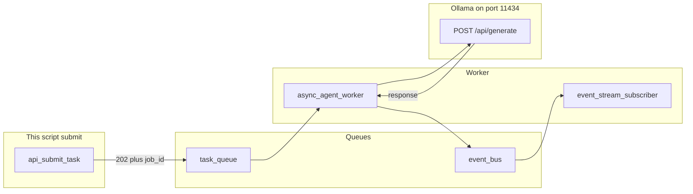

# Lab 3: Async event queue

A submit returns `status_code` 202 immediately and a worker later emits `agent.completed`.

## What you touch
- Script: `lab3_async_event_queue.py`
- Functions: `emit_event`, `async_agent_worker`, `event_stream_subscriber`, `api_submit_task`, `main`
- Queues: `task_queue`, `event_bus` (both `asyncio.Queue()`)
- URL / path: `{OLLAMA_HOST}/api/generate` (default `http://127.0.0.1:11434/api/generate`)
- Keys sent (worker only): `model`, `prompt`, `stream` (`false`), `options.temperature` (`0.0`)
- Keys read: `response`
- Event types: `job.started`, `agent.thought`, `agent.completed`, `agent.failed`
- Submit prompt: `Explain async event queues.`
- No listening HTTP server. 202 is a dict return value.

## Steps


1. Read `OLLAMA_HOST` and `OLLAMA_MODEL` from the environment. If they are unset, use `http://127.0.0.1:11434` and `llama3.2:1b`. The route is `{host}/api/generate`.
2. Create `task_queue = asyncio.Queue()` and `event_bus = asyncio.Queue()`.
3. Write `emit_event(event_type, job_id, data)`. Put `{ "event_type", "job_id", "timestamp": time.time(), "data" }` on `event_bus`.
4. Write `async_agent_worker(worker_id)`. Loop: `job = await task_queue.get()`. Read `job["job_id"]` and `job["prompt"]`. Emit `job.started`. Build a POST body: `model`, `prompt` (`Analyze in 1 sentence how async queues prevent timeouts: {prompt}`), `stream: false`, `options.temperature: 0.0`. Emit `agent.thought`. Run `urllib.request.urlopen(req, timeout=30)` inside `loop.run_in_executor`. On success emit `agent.completed` with `{ "result": answer, "status": "SUCCESS" }`. On exception emit `agent.failed`. Call `task_queue.task_done()`.
5. Write `event_stream_subscriber`. Loop: `event = await event_bus.get()`. Print `[STREAM EVENT]` plus `event_type`, `job_id`, and `data`.
6. Write `api_submit_task(prompt)`. Set `job_id = f"job_{int(time.time() * 1000)}"`. Put `{ "job_id", "prompt" }` on `task_queue`. Return `{ "status_code": 202, "message": "Accepted", "job_id", "status_url": f"/api/jobs/{job_id}" }`. Do not POST here.
7. In `main`, `asyncio.create_task` the worker and the subscriber. Time `api_submit_task("Explain async event queues.")`. Print the 202 and the elapsed seconds. `await task_queue.join()`. Sleep 0.5s so the subscriber can print. Cancel both tasks.
8. Run with `asyncio.run(main())`. If the host is unreachable, you should still see 202 first, then `agent.failed`.

## Data contract
Only the keys this script sends and reads.

**Submit return**

```json
{
  "status_code": 202,
  "message": "Accepted",
  "job_id": "job_1",
  "status_url": "/api/jobs/job_1"
}
```

**Job on `task_queue`**

```json
{ "job_id": "job_1", "prompt": "Explain async event queues." }
```

**Worker request** `POST /api/generate`

```json
{
  "model": "llama3.2:1b",
  "prompt": "string",
  "stream": false,
  "options": { "temperature": 0.0 }
}
```

**Event frame**

```json
{
  "event_type": "agent.completed",
  "job_id": "job_1",
  "timestamp": 0,
  "data": { "result": "string", "status": "SUCCESS" }
}
```

## Run
From the repo root:

```bash
OLLAMA_HOST=http://127.0.0.1:11434 OLLAMA_MODEL=llama3.2:1b python education/06_the_workflow/lab3_async_event_queue.py
```

```powershell
$env:OLLAMA_HOST="http://127.0.0.1:11434"
$env:OLLAMA_MODEL="llama3.2:1b"
python education/06_the_workflow/lab3_async_event_queue.py
```

## What you should see
`[CLIENT] Received HTTP 202 response in 0.00xxs!` then a `job_id`, then `[STREAM EVENT]` lines for `job.started`, `agent.thought`, and `agent.completed` (or `agent.failed`). The 202 line must print before the completed event. If 202 takes many seconds, submit is waiting on the POST. If you see no stream lines, the subscriber task was not started. If you see `URLError` inside submit, the POST is in the wrong function.

## Stop here
This is not FastAPI. Do not open a port. Do not add Redis, Kafka, or Celery. Next: [00_persona_tools_loop_state.md](../07_one_agent/00_persona_tools_loop_state.md).

## Notes
- 202 avoids a gateway 504. The subscriber is a stand-in for SSE or a WebSocket.
- `status_url` is a string. Nothing listens on it in this lab.
- Keys sent and read match this brief. Do not edit the `.py` in the repo.
- Chapter 10 serves these frames over SSE on a real socket.
