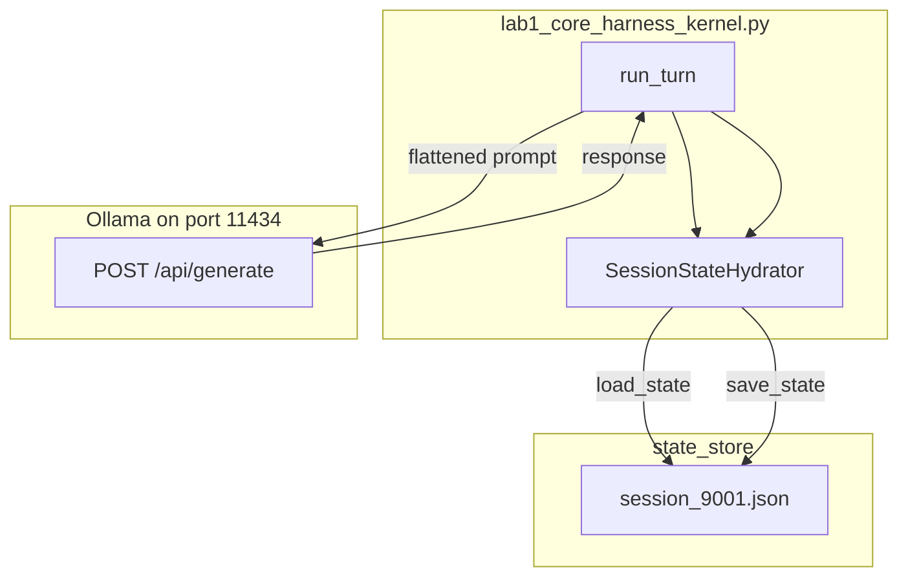

# 07: One agent

After this chapter the word agent is earned: a persona (system prompt) plus tools plus the chapter 04 loop plus chapter 05 state, in one process. Two agents are chapter 08.

## Data
Chapters 03 to 05 are separate scripts. This chapter puts them in one host object.

A **persona** is the `role: system` string. It is the first item in `messages`. It does not change between turns.

**Tools** are the same pair as chapter 03 and 04: `TOOLS_SCHEMA` (sent on the POST) and `TOOL_REGISTRY` (name to Python function). The intended kernel can dispatch `tool_calls` inside `run_turn`.

The **loop** is chapter 04: `for turn in range` around `POST /api/chat` until `tool_calls` is empty or `max_turns` is hit.

**State** is a session JSON file. `SessionStateHydrator` in `lab1_core_harness_kernel.py` reads and writes `state_store/{session_id}.json`. Keys: `session_id`, `messages`, `turn_count`. `load_state(session_id)` returns that object or a fresh one. `save_state(session_id, state)` writes it.

The **kernel** is class `CoreAgentKernel`. `run_turn(session_id, user_prompt)` loads, appends the user line, calls the model, appends the assistant line, saves, and returns `{ session_id, turn_count, thinking, response }`.

`OLLAMA_HOST` should default to `http://192.168.1.29:11434`. `OLLAMA_MODEL` should default to `qwen3.6:35b-a3b-65k`. The intended route is `POST /api/chat`.

The reference script also contains `CoTStreamDemuxer`, which splits `<think>` text from the visible reply. Full thinking-token demux is chapter 12. Do not treat that class as this chapter's idea.

## Information
One agent is one process that keeps a persona, can call tools, loops until text, and writes the `messages` list to disk so the next `run_turn` on the same `session_id` sees the earlier lines.

Without hydration, turn 2 is a new empty list and the model does not know the name from turn 1. The file is how the second call sees `Hello! My name is Jacob.`

Sandbox and RBAC are chapter 09. FastAPI is chapter 10. A second kernel is chapter 08.

## Knowledge
1. Load `state_store/{session_id}.json` (or start `{ session_id, messages: [], turn_count: 0 }`).
2. If `messages` is empty, append the system persona. Append `{ "role": "user", "content": user_prompt }`. Increment `turn_count`.
3. POST `model`, `messages`, `tools`, `stream: false`, `options.temperature: 0.0` to `{OLLAMA_HOST}/api/chat`. Run the chapter 04 loop if `tool_calls` appear.
4. Append the assistant text (optionally drop `<think>`). Save the session file.
5. Call `run_turn` a second time on the same id. The second reply should use a fact from the first user line.
6. Do not add Docker, a permission matrix, or a second agent.

## Wisdom
One kernel is enough for a single user and one session file. Tools and a ReAct loop belong in the intended kernel. They are not required to prove hydration: two `run_turn` calls on `session_9001` are enough to see the name persist. Docker, RBAC, and a second process are later chapters. If you add them now, a missed name could come from the file, the POST, or the sandbox.

## The When and Why
- **When:** you need the same conversation after the script exits, or after a second `run_turn` in the same process.
- **Why:** without hydration the loop is a one-shot script. The file is what makes it an agent you can come back to.

## How it works



Walkthrough of the lab session `session_9001`:

1. `run_turn("session_9001", "Hello! My name is Jacob.")` loads a missing file as an empty `messages` list.
2. The script appends the user line, builds one prompt string from every `role` and `content`, and POSTs `/api/generate`.
3. It reads `response`, runs `CoTStreamDemuxer.feed`, appends the visible text as `role: assistant`, and writes `state_store/session_9001.json`.
4. `run_turn("session_9001", "What is my name?")` loads that file. The first user line is still in `messages`. The second reply should contain Jacob.

The new fact is the file between the two calls. The demuxer is extra.

## Data contract

**Intended request** `POST /api/chat`

```json
{
  "model": "qwen3.6:35b-a3b-65k",
  "messages": [],
  "tools": [],
  "stream": false,
  "options": { "temperature": 0.0 }
}
```

**Session JSON** (`state_store/{session_id}.json`)

```json
{
  "session_id": "session_9001",
  "messages": [],
  "turn_count": 0
}
```

**`run_turn` return**

```json
{
  "session_id": "session_9001",
  "turn_count": 2,
  "thinking": "string",
  "response": "string"
}
```

**What the reference script actually sends** `POST /api/generate` with `model`, `prompt` (flattened `ROLE: content` lines plus `ASSISTANT:`), `stream: false`, `options.temperature: 0.2`. It reads `response`. It does not send `messages` or `tools`. Host and model are hardcoded. See Notes.

## Lab
Done when turn 2 answers with the name from turn 1.

- Module: [this file](./00_persona_tools_loop_state.md)
- Lab 1: [lab1_core_harness_kernel.py](./lab1_core_harness_kernel.py) / [lab1_core_harness_kernel.md](./lab1_core_harness_kernel.md) — two `run_turn` calls on `session_9001`. Done when the second `response` contains Jacob and `state_store/session_9001.json` exists.

## Related
- **Chapter 04 loop:** the intended inner loop when `tool_calls` appear.
- **Chapter 05 JSON file:** same save/load. This chapter names the file a session.
- **Claude Code / Cursor harness:** same four pieces at product scale.

## Notes
- The reference script remembers `My name is Jacob` across two `run_turn` calls.
- Contract drift vs `lab1_core_harness_kernel.py`: no `OLLAMA_HOST` / `OLLAMA_MODEL` read (URL and model are literals). Route is `/api/generate`, not `/api/chat`. No `tools` key and no dispatcher. No `role: system` persona on the wire. `messages` are joined into one `prompt` string. `temperature` is `0.2`. `CoTStreamDemuxer` runs on every reply. The print banner still says `MODULE 11`. The intended contract is persona plus tools plus the chapter 04 loop plus the session file. Write that in your copy. Leave the reference file as-is.
- Do not commit `state_store/*.json`.
