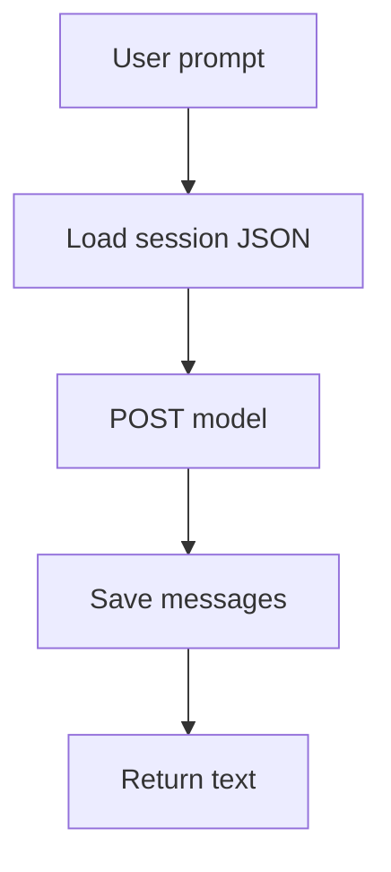

# 07: One agent

After this chapter the word agent is earned: a persona (system prompt) + tools + the chapter 04 loop + chapter 05 state in one process.

## Data
- Kernel class: `CoreAgentKernel`
- State store: `state_store/{session_id}.json` with `messages`, `turn_count`
- Hydrator: `load_state` / `save_state`
- Loop: `run_turn(session_id, user_prompt)`
- The existing reference script also strips `<think>` tags. Full CoT demux is chapter 12.

## Information
Chapters 03–05 are pieces. This chapter puts them in one host process. Sandbox and RBAC are chapter 09. FastAPI is chapter 10.

## Knowledge
1. Load session JSON.
2. Append the user message.
3. Call the model.
4. Keep assistant text (optionally drop `<think>`).
5. Save the session.

## Wisdom
One kernel is enough for a single user and one session file. Do not add Docker or a permission matrix here.

## The When and Why
- **When:** you need the same conversation after the script exits.
- **Why:** without hydration the loop is a one-shot script.

## How it works



## Data contract
**Session JSON**

```json
{ "session_id": "session_9001", "messages": [], "turn_count": 0 }
```

## Lab
- [lab1_core_harness_kernel.py](./lab1_core_harness_kernel.py) / [lab1_core_harness_kernel.md](./lab1_core_harness_kernel.md) — Done when turn 2 answers with the name from turn 1.

## Related
- **Claude Code / Cursor harness:** same four pieces at product scale.

## Notes
The reference script remembers `My name is Jacob` across two `run_turn` calls.
