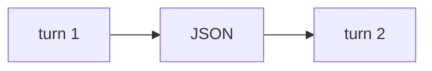

# Lab 1: Core harness kernel

After this lab a JSON file holds two turns and the second answer uses the first.

## Data
- Script: `lab1_core_harness_kernel.py`
- Store: `state_store/session_9001.json` (runtime; do not commit secrets)

## Information
Hydrate → call → save. That is the kernel.

## Knowledge
1. `run_turn` twice on the same session id.
2. Confirm the file grew.
3. Confirm turn 2 text includes the name.

## Wisdom
Do not treat CoT demux as the point of this lab. Chapter 12 owns that.

## The When and Why
- **When:** you want multi-turn memory in one process.
- **Why:** this is the smallest persona + loop + state script.

## How it works



## Data contract
See the module session JSON.

## Run

```bash
python education/07_one_agent/lab1_core_harness_kernel.py
```

## What you should see
Turn 2 response names Jacob. A `state_store/session_9001.json` file exists.

## What this becomes later
Chapter 15 snaps more pieces onto this kernel.

## Related
- **Chapter 05:** same save/load, SQLite instead of JSON.

## Notes
Do not commit `state_store/*.json` session dumps.
