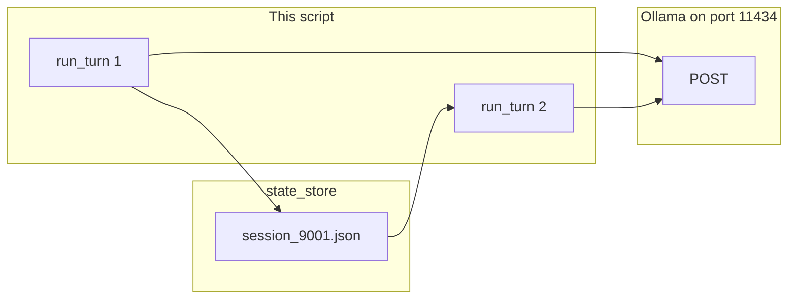

# Lab 1: Core harness kernel

A JSON file holds two turns and the second answer uses the name from the first.

## What you touch
- Script: `lab1_core_harness_kernel.py`
- Classes: `SessionStateHydrator` (`load_state`, `save_state`), `CoreAgentKernel` (`run_turn`), and `CoTStreamDemuxer` (present in the reference file; not the point of this lab)
- Store: `state_store/{session_id}.json` beside the script (runtime; do not commit)
- Session keys: `session_id`, `messages`, `turn_count`
- Session id in `__main__`: `session_9001`
- Prompts: `Hello! My name is Jacob.` then `What is my name?`
- Intended URL: `{OLLAMA_HOST}/api/chat` (default host `http://192.168.1.29:11434`)
- Reference URL: hardcoded `http://192.168.1.29:11434/api/generate` (see Notes)

## Steps


1. Read `OLLAMA_HOST` and `OLLAMA_MODEL` from the environment. If they are unset, use `http://192.168.1.29:11434` and `qwen3.6:35b-a3b-65k`.
2. Write `SessionStateHydrator`. Default dir is `state_store` next to the script. `load_state(session_id)` reads `{session_id}.json` or returns `{ "session_id", "messages": [], "turn_count": 0 }`. `save_state` writes that object with `json.dump`.
3. Write `CoreAgentKernel.run_turn(session_id, user_prompt)`. Load state. If `messages` is empty, append a `role: system` persona. Append `{ "role": "user", "content": user_prompt }`. Increment `turn_count`.
4. Intended POST: `model`, `messages`, `tools` (can be empty for this name-memory check), `stream: false`, `options.temperature: 0.0` to `{host}/api/chat`. If `tool_calls` appear, run the chapter 04 loop. Read assistant `content`.
5. Append `{ "role": "assistant", "content": response_text }`. Save the session. Return `{ session_id, turn_count, thinking, response }`.
6. In `__main__`, construct the kernel. Call `run_turn("session_9001", "Hello! My name is Jacob.")`, then `run_turn("session_9001", "What is my name?")`. Print the second return dict.
7. Confirm `state_store/session_9001.json` exists and `turn_count` is 2. If the host is unreachable, print the error and exit. Do not retry.

## Data contract
Intended keys this lab should send and read. The reference file differs (Notes).

**Intended request** `POST /api/chat`

```json
{
  "model": "qwen3.6:35b-a3b-65k",
  "messages": [],
  "tools": [],
  "stream": false,
  "options": { "temperature": 0.0 }
}
```

**Session file** `state_store/session_9001.json`

```json
{
  "session_id": "session_9001",
  "messages": [],
  "turn_count": 0
}
```

**`run_turn` return**

```json
{
  "session_id": "session_9001",
  "turn_count": 2,
  "thinking": "string",
  "response": "string"
}
```

**Reference script request** `POST /api/generate`

```json
{
  "model": "qwen3.6:35b-a3b-65k",
  "prompt": "USER: Hello! My name is Jacob.\nASSISTANT:",
  "stream": false,
  "options": { "temperature": 0.2 }
}
```

It reads `response` only.

## Run
From the repo root:

```bash
python education/07_one_agent/lab1_core_harness_kernel.py
```

```powershell
$env:OLLAMA_HOST="http://192.168.1.29:11434"
$env:OLLAMA_MODEL="qwen3.6:35b-a3b-65k"
python education/07_one_agent/lab1_core_harness_kernel.py
```

The reference script ignores those env vars. They are listed so the Run block matches the other chapters.

## What you should see
Two `[KERNEL] Starting Turn for Session: 'session_9001'` blocks. Each prints a `[THINKING LOG]` and a `[RESPONSE PAYLOAD]`. The second `response` contains Jacob. `Final State Checkpoint Verified` prints a JSON object with `turn_count: 2`. `education/07_one_agent/state_store/session_9001.json` exists and lists both user lines. If turn 2 does not know the name, `save_state` did not run or turn 2 loaded a new id. If you see `URLError`, the provider is not reachable at the hardcoded host.

## Stop here
Do not treat CoT demux as the point of this lab. Do not add Docker, RBAC, or a second agent. Chapter 08 starts a second kernel. Chapter 09 adds a sandbox. Chapter 12 owns thinking-token demux. Chapter 15 snaps more pieces onto this kernel.

## Notes
- Do not commit `state_store/*.json` session dumps.
- Contract drift vs `lab1_core_harness_kernel.py`: host and model are literals, not env. Route is `/api/generate`. No `tools`. No system persona on the wire. `messages` are flattened into `prompt`. `temperature` is `0.2`. `CoTStreamDemuxer` runs on every reply. Banner says `MODULE 11`. The intended contract is persona plus tools plus the chapter 04 loop plus the session file. Write that in your copy. Do not edit the `.py` in the repo.
