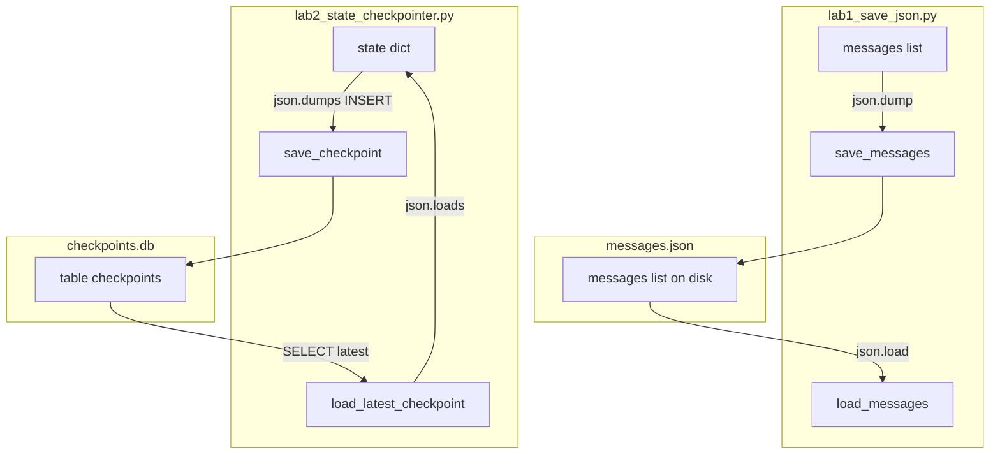

# 07: The State: Persisting Messages and Checkpointing Execution

By the end of this chapter, you will be able to persist conversation history and agent state to disk using both flat JSON files and SQLite checkpointers. This enables your agents to resume tasks across process restarts without losing progress.

In Chapter 04, all conversation state lived in temporary RAM. In this chapter, we create durable checkpoints so multi-step workflows can survive crashes, restarts, and pauses.

## Data
We examine two primary persistence formats:
1. **Flat JSON Persistence**: Writing the in-memory `messages` list directly to `messages.json` using `json.dump()` and reloading it with `json.load()`.
2. **SQLite State Checkpointing**: Writing structured snapshots to a SQLite database table (`checkpoints.db`) with columns:
   - `thread_id` (TEXT): A unique identifier for a specific conversation session (e.g. `task_session_101`).
   - `step_name` (TEXT): The name of the workflow step being executed.
   - `checkpoint_id` (INTEGER PRIMARY KEY): Auto-incrementing snapshot version.
   - `state_data` (TEXT): Serialized JSON payload containing state variables.
   - `timestamp` (REAL): Unix timestamp recording when the checkpoint was saved.

## Information
In-memory variables disappear as soon as a script terminates or encounters an unexpected exception. 

By persisting state to disk after each critical step:
- **Resilience**: If an agent process is interrupted, it can reload the latest checkpoint from SQLite and pick up right where it left off.
- **Auditability**: You maintain a complete chronological audit trail of how state evolved across every turn.

## Knowledge
Here is the step-by-step procedure:
1. Initialize the SQLite database and create the `checkpoints` table.
2. After completing a workflow step, serialize the state dictionary to JSON and execute an `INSERT` statement into `checkpoints`.
3. To resume execution, query the latest record for a given `thread_id` using:
   ```sql
   SELECT step_name, state_data FROM checkpoints WHERE thread_id = ? ORDER BY checkpoint_id DESC LIMIT 1
   ```
4. Deserialize `state_data` with `json.loads()` to restore working memory.

## Wisdom
A simple SQLite checkpointer is lightweight, fast, and requires zero external database servers. Keep state dictionaries free of un-serializable objects (like open file handles or active socket connections).

## The When and Why
- **When**: Use state checkpointers whenever agents run multi-step tasks, execute batch jobs, or handle asynchronous user sessions.
- **Why**: Without persistence, any network blip, timeout, or machine restart erases all conversational context and forces the user to start over from scratch.

## How it works



Walkthrough of lab 1:

1. Build a short `messages` list with `system`, `user`, and `assistant` items.
2. `save_messages` writes that list to `messages.json` with `json.dump`.
3. `load_messages` reads the same path with `json.load` and prints each `role` and `content`.

Walkthrough of the lab 2 thread `task_session_101`:

1. `init_sqlite_checkpointer` creates `checkpoints` if the table is missing.
2. `node_draft_code` sets `code` to a one-line `calculate_total`. `save_checkpoint` writes step `draft_code`.
3. `node_run_tests` sets `attempts` to 1 and `test_passed` to false. The script prints `[FAIL]`. Step `run_tests_attempt_1` is saved.
4. `node_refactor_code` replaces `code` with a version that checks `price < 0`. Step `refactor_attempt_1` is saved.
5. `node_run_tests` sets `attempts` to 2 and `test_passed` to true. The script prints `[PASS]`. Step `run_tests_attempt_2` is saved.
6. After the run, `load_latest_checkpoint("task_session_101")` SELECTs that last row and prints `Restored Code` plus the refactored function.

Nothing in those walkthroughs calls Ollama. The nodes are ordinary Python functions. Lab 1 is the file. Lab 2 is the INSERT and the SELECT.

## Data contract

**JSON-file form** (lab 1)

```json
[
  { "role": "system", "content": "string" },
  { "role": "user", "content": "string" },
  { "role": "assistant", "content": "string" }
]
```

**save** `json.dump` of that list to `messages.json`.

**load** `json.load` of that list. Print each `role` and `content`.

**Table** (lab 2)

```sql
CREATE TABLE checkpoints (
    thread_id TEXT,
    step_name TEXT,
    checkpoint_id INTEGER PRIMARY KEY AUTOINCREMENT,
    state_data TEXT,
    timestamp REAL
)
```

**state_data example** (what `json.dumps` writes into the TEXT column)

```json
{ "code": "string", "attempts": 0, "test_passed": false }
```

**save** INSERTs `thread_id`, `step_name`, `state_data`, `timestamp`. SQLite fills `checkpoint_id`.

**load** SELECTs `step_name, state_data WHERE thread_id = ? ORDER BY checkpoint_id DESC LIMIT 1`.

## Lab
Done when lab 1 prints each loaded `role` and `content`, and lab 2 reloads the last saved `code`.

- Module: [this file](./00_save_the_messages.md)
- Lab 1: [lab1_save_json.md](./lab1_save_json.md) — write `lab1_save_json.py`. `json.dump` / `json.load` of a `messages` list to `messages.json`. Functions `save_messages` / `load_messages`. Done when load prints each `role` and `content`.
- Lab 2: [lab2_state_checkpointer.py](./lab2_state_checkpointer.py) / [lab2_state_checkpointer.md](./lab2_state_checkpointer.md) — SQLite INSERT/SELECT. Done when `load_latest_checkpoint` prints the refactored `code`.

## Related
- **JSON file:** `json.dump` / `json.load` if you do not need more than one snapshot. Lab 1.
- **LangGraph checkpointer:** same INSERT/SELECT behind a framework class.
- **SQLite:** one file, no server. What lab 2 uses.

## Notes
- Windows console: use `[FAIL]` / `[PASS]` instead of emoji (cp1252).
- `messages.json` sits next to lab 1. `checkpoints.db` sits next to lab 2 and is gitignored. Override the DB path with `CHECKPOINT_DB`.
- Neither lab sends `OLLAMA_HOST` or `OLLAMA_MODEL`. There is no HTTP call.
