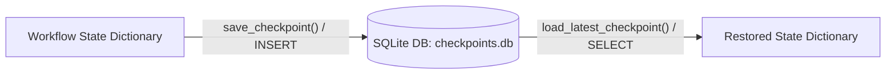

# Lab 2: Building a SQLite State Checkpointer

In this lab, you will build an automated SQLite state checkpointer that saves snapshots of a multi-step agent workflow and restores the latest state via `load_latest_checkpoint(thread_id)`.

---

## What you touch
- Script: `lab2_state_checkpointer.py`
- Main Functions:
  - `init_sqlite_checkpointer()`
  - `save_checkpoint(thread_id, step_name, state)`
  - `load_latest_checkpoint(thread_id) -> dict`
  - `run_stateful_graph(thread_id, max_retries=3)`
- Database File: `checkpoints.db` (overrideable with `CHECKPOINT_DB` environment variable)
- SQLite Table: `checkpoints` (`thread_id`, `step_name`, `checkpoint_id`, `state_data`, `timestamp`)
- State Dictionary Keys: `code` (str), `attempts` (int), `test_passed` (bool)

---

## Steps


1. Configure database path from `CHECKPOINT_DB` or default to `checkpoints.db` next to the script.
2. Implement `init_sqlite_checkpointer()`:
   - Connect to SQLite and run `CREATE TABLE IF NOT EXISTS checkpoints ...`.
3. Implement `save_checkpoint(thread_id: str, step_name: str, state: dict)`:
   - Insert `(thread_id, step_name, json.dumps(state), time.time())`.
   - Print `[CHECKPOINT SAVED]` with step name and thread ID.
4. Implement `load_latest_checkpoint(thread_id: str) -> dict`:
   - Query `SELECT step_name, state_data FROM checkpoints WHERE thread_id = ? ORDER BY checkpoint_id DESC LIMIT 1`.
   - If found, deserialize with `json.loads(state_data)` and return the dictionary. Otherwise return `{}`.
5. Create workflow nodes:
   - `node_draft_code`: sets initial draft code.
   - `node_run_tests`: simulates testing (fails on attempt 1, passes on attempt 2).
   - `node_refactor_code`: updates code to handle edge cases.
6. In `run_stateful_graph("task_session_101")`:
   - Save checkpoints after every step (draft, test attempt 1, refactor, test attempt 2).
7. Test reloading state with `load_latest_checkpoint("task_session_101")` and verify that the final refactored code is restored.

---

## Data contract

**Checkpoints Table Schema**

```sql
CREATE TABLE checkpoints (
    thread_id TEXT,
    step_name TEXT,
    checkpoint_id INTEGER PRIMARY KEY AUTOINCREMENT,
    state_data TEXT,
    timestamp REAL
);
```

**Serialized `state_data` Payload**

```json
{
  "code": "def calculate_total(price, tax):\n    if price < 0:\n        raise ValueError('Price cannot be negative')\n    return price + tax",
  "attempts": 2,
  "test_passed": true
}
```

---

## Run
From the repository root, run:

```bash
python education/07_the_state/lab2_state_checkpointer.py
```

```powershell
python education/07_the_state/lab2_state_checkpointer.py
```

---

## What you should see
- `[CHECKPOINT SAVED]` notifications after each step: `draft_code`, `run_tests_attempt_1` (`[FAIL]`), `refactor_attempt_1`, and `run_tests_attempt_2` (`[PASS]`).
- Final workflow summary with `test_passed: true` and `attempts: 2`.
- `[CHECKPOINT LOADED]` message followed by the restored refactored function.

---

## Stop here
You now have a durable state checkpointer! In Chapter 08, we will explore context compaction and token window management.

Next up: [Chapter 08: Context Compaction](../08_context_compaction/00_context_compaction.md).

---

## Notes
*(Record your checkpoint restoration trace here)*

