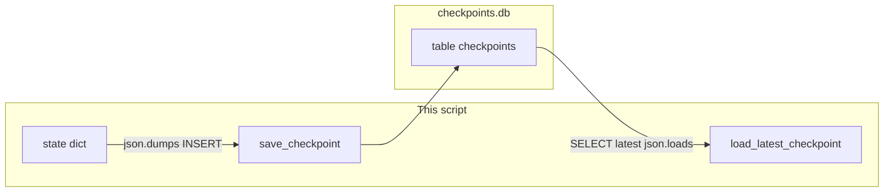

# Lab 2: State checkpointer

A SQLite row holds the latest state dict and `load_latest_checkpoint` prints the last saved `code`.

## What you touch
- Script: `lab2_state_checkpointer.py`
- Functions: `init_sqlite_checkpointer`, `save_checkpoint(thread_id, step_name, state)`, `load_latest_checkpoint(thread_id)`, `run_stateful_graph(thread_id, max_retries=3)`
- Nodes: `node_draft_code`, `node_run_tests`, `node_refactor_code`
- DB file: `checkpoints.db` beside the script, or the path in `CHECKPOINT_DB`
- Table: `checkpoints` (`thread_id`, `step_name`, `checkpoint_id`, `state_data`, `timestamp`)
- State keys: `code` (string), `attempts` (int), `test_passed` (bool)
- Thread id used in `__main__`: `task_session_101`
- No HTTP. This script does not read `OLLAMA_HOST` or `OLLAMA_MODEL`.

## Steps


1. Set `DB_PATH` from `CHECKPOINT_DB`, or `os.path.join(os.path.dirname(__file__), "checkpoints.db")`.
2. Write `init_sqlite_checkpointer`. Connect with `sqlite3.connect(DB_PATH)`. `CREATE TABLE IF NOT EXISTS checkpoints` with `thread_id TEXT`, `step_name TEXT`, `checkpoint_id INTEGER PRIMARY KEY AUTOINCREMENT`, `state_data TEXT`, `timestamp REAL`.
3. Write `save_checkpoint(thread_id, step_name, state)`. INSERT `thread_id`, `step_name`, `json.dumps(state)`, `time.time()`. Print `[CHECKPOINT SAVED]`.
4. Write `load_latest_checkpoint(thread_id)`. SELECT `step_name, state_data WHERE thread_id = ? ORDER BY checkpoint_id DESC LIMIT 1`. If a row exists, print `[CHECKPOINT LOADED]` and return `json.loads(state_data)`. If not, return `{}`.
5. Write the three nodes. `node_draft_code` sets `code` to `def calculate_total(price, tax): return price + tax` and `test_passed` to false. `node_run_tests` increments `attempts`. If `attempts < 2`, print `[FAIL]` and set `test_passed` false. Else print `[PASS]` and set `test_passed` true. `node_refactor_code` replaces `code` with a version that raises `ValueError` when `price < 0`.
6. Write `run_stateful_graph`. Init the table. Start `state = {"code": "", "attempts": 0, "test_passed": False}`. Call draft, save step `draft_code`. Loop while `attempts < max_retries` (default 3): run tests, save `run_tests_attempt_{attempts}`. If `test_passed`, break. Else refactor and save `refactor_attempt_{attempts}`.
7. In `__main__`, call `run_stateful_graph("task_session_101")`, then `load_latest_checkpoint("task_session_101")`, then print `Restored Code:` and `restored_state.get("code")`.

## Data contract
Only the keys this script writes and reads.

**Table**

```sql
CREATE TABLE checkpoints (
    thread_id TEXT,
    step_name TEXT,
    checkpoint_id INTEGER PRIMARY KEY AUTOINCREMENT,
    state_data TEXT,
    timestamp REAL
)
```

**state_data** (TEXT column, JSON)

```json
{ "code": "string", "attempts": 0, "test_passed": false }
```

**save** INSERT `(thread_id, step_name, state_data, timestamp)`.

**load** SELECT `step_name, state_data FROM checkpoints WHERE thread_id = ? ORDER BY checkpoint_id DESC LIMIT 1`.

`thread_id` in the run is `task_session_101`.

## Run
From the repo root:

```bash
python education/07_the_state/lab2_state_checkpointer.py
```

```powershell
python education/07_the_state/lab2_state_checkpointer.py
```

This script does not read `OLLAMA_HOST` or `OLLAMA_MODEL`. Do not set those vars for this lab. Optional: `$env:CHECKPOINT_DB` to point at another `.db` file.

## What you should see
`[CHECKPOINT SAVED]` after draft, after the first test (`[FAIL]`), after refactor, and after the second test (`[PASS]`). Then `=== FINAL PERSISTED WORKFLOW STATE ===` with JSON that has `test_passed: true` and `attempts: 2`. Then `[CHECKPOINT LOADED]` and `Restored Code:` followed by the refactored `calculate_total` that checks `price < 0`. If the DB path is wrong, create the directory or set `CHECKPOINT_DB`. If load prints nothing for `code`, the SELECT did not find `task_session_101`.

## Stop here
This is not RAG. Do not add a vector store. Do not compact old rows. Do not POST to the model. The lesson is INSERT and SELECT of a state dict. Do not invent a graph of named edges here. Next: [00_context_compaction.md](../08_context_compaction/00_context_compaction.md).

## Notes
- Schema is `thread_id`, `step_name`, `checkpoint_id`, `state_data`, `timestamp`.
- Emoji in prints broke Windows cp1252. The script uses `[FAIL]` / `[PASS]`.
- `checkpoints.db` is gitignored. Do not commit it.
- Keys written and read match this brief. Do not edit the `.py` in the repo.
- Chapter 08 adds compaction, Chapter 09 adds memory, and Chapter 10 adds graph workflows.
