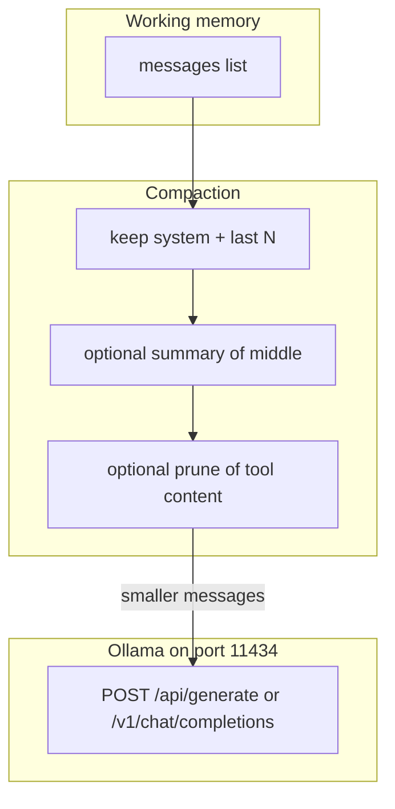

# 08: Context Compaction: Sliding Windows and Conversation Summarization

By the end of this chapter, you will implement context compaction strategies that keep active conversation histories within model context limits. You will build a sliding window mechanism that preserves system instructions and recent turns while condensing older history into compact summaries.

In Chapter 07, we persisted message history. In this chapter, we ensure that as conversation histories grow, they remain fast, inexpensive, and within token limits.

## Data
As multi-turn conversations expand, sending every historical message on every turn causes two issues:
1. **Latency & Cost**: Time-to-first-token (TTFT) and API costs increase linearly with input prompt length.
2. **Context Window Limits**: Models have maximum input context windows, beyond which requests fail.

To manage context effectively, we apply **Context Compaction**:
- **Sliding Window**: Keep the foundational `system` prompt (index 0) and the most recent $N$ conversational turns (`messages[-last_n:]`).
- **Middle Summarization**: Condense dropped intermediate messages into a single summary message (`{"role": "assistant", "content": "Summary: ..."}`) placed between the system prompt and recent turns.
- **Content Pruning**: Truncate overly verbose tool outputs (e.g. large file dumps or logs) to safe character limits.

## Information
Context compaction keeps working memory focused on what is relevant right now:
- **System Directives**: Pinned at the start so behavioral guidelines are never lost.
- **Historical Context**: Condensed into an efficient summary so the agent retains awareness of earlier agreements and facts.
- **Immediate Context**: The most recent exchanges preserved verbatim so dialogue flows naturally.

## Knowledge
Here is the step-by-step procedure:
1. Measure the size of `messages` (by counting characters or tokens).
2. If the size exceeds your budget threshold:
   - Extract and preserve the system prompt (`messages[0]`).
   - Extract the recent history slice (`messages[-last_n:]`).
   - Collect the dropped intermediate messages.
   - Condense dropped messages into a concise summary string.
   - Assemble the compacted list: `[system_prompt] + [summary_message] + recent_slice`.
3. Return the compacted `messages` array for subsequent model requests.

## Wisdom
A deterministic sliding window combined with local summarization prevents context overflow without requiring external vector databases.

## The When and Why
- **When**: Use context compaction in long-running chat sessions, agentic loops, and multi-turn workflows.
- **Why**: Language models have fixed attention and context budgets. Trimming unnecessary historical detail speeds up generation and prevents context exhaustion.

## How it works



Walkthrough of one compact-then-POST:

1. You have a `messages` list from chapter 05 (RAM, JSON file, or `checkpoints.db`).
2. You count characters or tokens. If the size is over your cap, you keep `messages[0]` when it is the system message, keep the last N items, and drop the rest.
3. If you want a summary, you POST the dropped turns as a `prompt` to `{OLLAMA_HOST}/api/generate` and insert the `response` text as one message in the middle.
4. If a tool message has a huge `content` string, you slice it to a max length.
5. You POST the new list. The host and model are unchanged.

Walkthrough of lab 1:

1. The fixture is 9 items: system plus four add-number turns.
2. `window_messages(..., 4)` keeps the system item and the last two turns. The first two turns are dropped.
3. `summarize_dropped` joins those dropped items into one `Summary:` string. No POST.
4. `compact_messages` returns 6 items. `after_count` is 6. `after_chars` is less than `before_chars`.

Nothing in that walkthrough opens a vector store. The new work is the smaller list.

## Data contract

**Intended compact result** (what you POST after the window)

Keep: system + last N messages.

```json
{
  "model": "qwen3.6:35b-a3b-65k",
  "messages": [
    { "role": "system", "content": "string" },
    { "role": "user", "content": "string" },
    { "role": "assistant", "content": "string" }
  ]
}
```

**Lab 1 compact result** (printed, not POSTed)

```json
[
  { "role": "system", "content": "You add numbers." },
  { "role": "assistant", "content": "Summary: string" },
  { "role": "user", "content": "What is 3 plus 3?" },
  { "role": "assistant", "content": "6" },
  { "role": "user", "content": "What is 4 plus 4?" },
  { "role": "assistant", "content": "8" }
]
```

On native generate, the same list is flattened into `prompt`. `stream` can be false. `options.temperature` can be `0.0` if you want a repeatable summary. Lab 1 does not POST.

## Lab
Done when `after_count` is 6 and the last turn is still `What is 4 plus 4?` / `8`.

- Module: [this file](./00_context_compaction.md)
- Lab 1: [lab1_context_window.md](./lab1_context_window.md) - write `lab1_context_window.py`. Window plus local summary. Done when before/after counts print and the system item stays.
- Chapter 09: [lab2_local_private_rag.py](../09_agentic_memory_and_rag/lab2_local_private_rag.py) / [lab2_local_private_rag.md](../09_agentic_memory_and_rag/lab2_local_private_rag.md) - vector RAG, not compaction.

## Related
- **Chapter 07:** saves the list. This chapter shrinks it.
- **[02_private_rag.md](../09_agentic_memory_and_rag/02_private_rag.md):** retrieval from a vector store. Different job.
- **[01_agentic_memory.md](../09_agentic_memory_and_rag/01_agentic_memory.md):** episodic vs procedural memory. Different job.

## Notes
- Compaction shrinks the active context window to preserve budget and model attention.
- Lab 1 has no reference `.py` yet. Write it from the brief. Do not edit other `.py` files in the repo.
