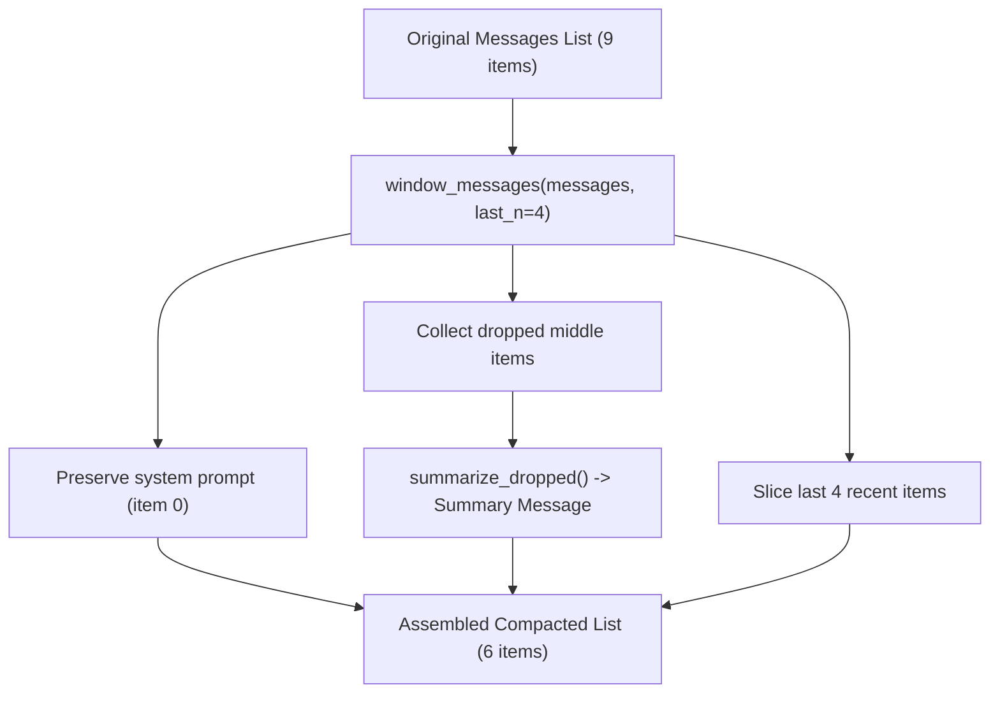

# Lab 1: Implementing a Sliding Window with Conversation Summarization

In this lab, you will write a compaction utility `compact_messages(messages, last_n)` that trims older conversational history while preserving the initial system instructions, generating a summary of dropped messages, and retaining the most recent turns.

---

## What you touch
- Script to create: `lab1_context_window.py`
- Main Functions:
  - `count_chars(messages: list) -> int`
  - `window_messages(messages: list, last_n: int) -> dict`
  - `summarize_dropped(dropped: list) -> dict`
  - `compact_messages(messages: list, last_n: int = 4) -> list`
- Test Fixture: A 9-message conversation list (1 system prompt + 4 multi-turn question/answer pairs)
- Pure Python logic (no network requests or environment variables needed)

---

## Steps


1. Create a 9-item test fixture `messages`:
   - Item 0: `{"role": "system", "content": "You add numbers."}`
   - Turn 1: `user`: `"What is 1 plus 1?"` / `assistant`: `"2"`
   - Turn 2: `user`: `"What is 2 plus 2?"` / `assistant`: `"4"`
   - Turn 3: `user`: `"What is 3 plus 3?"` / `assistant`: `"6"`
   - Turn 4: `user`: `"What is 4 plus 4?"` / `assistant`: `"8"`
2. Implement `count_chars(messages: list) -> int` to return `len(json.dumps(messages))`.
3. Implement `window_messages(messages, last_n)`:
   - Extract `system_msg = messages[0]` if `role == "system"`.
   - Slice `kept_tail = messages[-last_n:]`.
   - Identify `dropped = messages[1:-last_n]`.
   - Return `{"kept_system": system_msg, "kept_tail": kept_tail, "dropped": dropped}`.
4. Implement `summarize_dropped(dropped)`:
   - Join dropped messages as `"user What is 1 plus 1?; assistant 2; ..."`.
   - Return `{"role": "assistant", "content": f"Summary: {joined_text}"}`.
5. Implement `compact_messages(messages, last_n=4)`:
   - Combine `[kept_system] + [summary_msg] + kept_tail`.
6. In `__main__`:
   - Print `before_count` and `before_chars`.
   - Execute `compact_messages(messages, 4)`.
   - Print `after_count` and `after_chars`.
   - Display each retained message's `role` and `content`.
   - Verify that `after_count` is 6 and the total character size is reduced.

---

## Data contract

**Original Un-compacted History (9 Items)**

```json
[
  { "role": "system", "content": "You add numbers." },
  { "role": "user", "content": "What is 1 plus 1?" },
  { "role": "assistant", "content": "2" },
  { "role": "user", "content": "What is 2 plus 2?" },
  { "role": "assistant", "content": "4" },
  { "role": "user", "content": "What is 3 plus 3?" },
  { "role": "assistant", "content": "6" },
  { "role": "user", "content": "What is 4 plus 4?" },
  { "role": "assistant", "content": "8" }
]
```

**Compacted Working Memory (6 Items)**

```json
[
  { "role": "system", "content": "You add numbers." },
  { "role": "assistant", "content": "Summary: user What is 1 plus 1?; assistant 2; user What is 2 plus 2?; assistant 4" },
  { "role": "user", "content": "What is 3 plus 3?" },
  { "role": "assistant", "content": "6" },
  { "role": "user", "content": "What is 4 plus 4?" },
  { "role": "assistant", "content": "8" }
]
```

---

## Run
From the repository root, run:

```bash
python education/08_context_compaction/lab1_context_window.py
```

```powershell
python education/08_context_compaction/lab1_context_window.py
```

---

## What you should see
- `before_count: 9` and the original character count.
- `after_count: 6` and the reduced character count.
- The 6 formatted messages showing the system prompt, the generated summary of turns 1 & 2, and turns 3 & 4 intact.

---

## Stop here
You have successfully implemented sliding window context compaction! In Chapter 09, we will explore agentic memory architectures and local Retrieval-Augmented Generation (RAG).

Next up: [Chapter 09: Agentic Memory and RAG](../09_agentic_memory_and_rag/00_agentic_memory.md).

---

## Notes
*(Record your compaction metrics and verified output here)*

