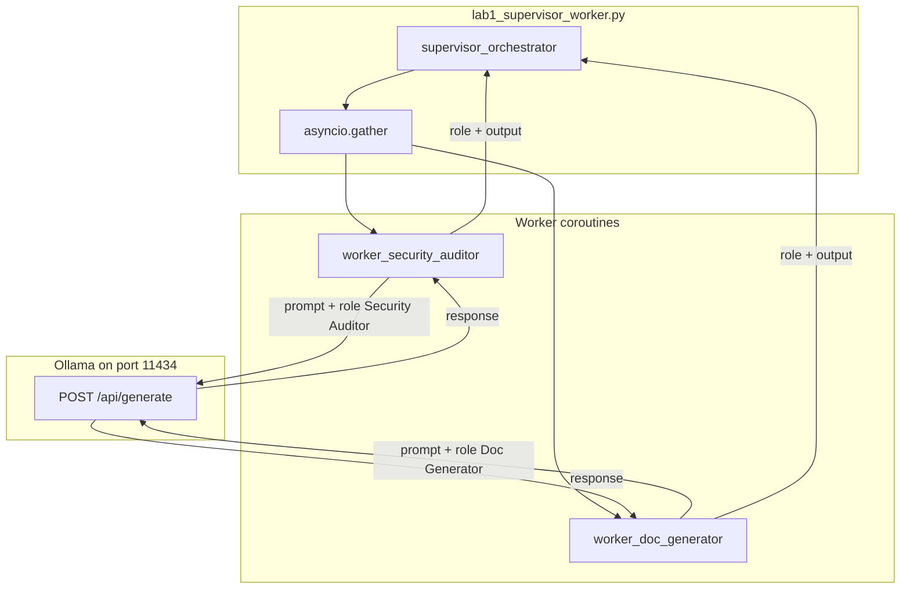

# 08: Two-agent topologies

After this page you can name hub-and-spoke, a tree, a peer handoff, and a bus. The labs implement two of those: supervisor-worker in `lab1_supervisor_worker.py` and a JSON handoff in `lab2_agent_handoff.py`.

## Data
A **topology** is the list of who starts a call, who waits, and who joins the answers.

**Hub-and-spoke** is one supervisor plus two or more workers. The supervisor is the hub. Each worker is a spoke. The supervisor starts both workers, waits for both, and prints or merges the results. `lab1_supervisor_worker.py` is this shape. The supervisor function is `supervisor_orchestrator`. The workers are `worker_security_auditor` and `worker_doc_generator`.

A **worker** is one isolated prompt plus one model call. Isolated means the worker does not see the other worker's `messages` list or system prompt. Each worker builds its own `prompt` string and POSTs it.

**Fan-out** is starting more than one worker at the same time. In the lab that is `asyncio.gather(worker_security_auditor(...), worker_doc_generator(...))`.

**Fan-in** is joining those returns in the supervisor. Each worker returns `{ "role": "string", "output": "string" }`. The supervisor loops that list and prints both reports.

A **tree** is a supervisor that starts a worker that itself starts more workers. The labs do not implement a tree.

A **peer handoff** is one agent finishing and passing a JSON object to a second agent. That is `lab2_agent_handoff.py` and the next page.

A **bus** is many agents publishing to a shared queue (Kafka, a gossip swarm). There is no bus in this chapter.

`OLLAMA_HOST` should default to `http://192.168.1.29:11434`. `OLLAMA_MODEL` should default to `qwen3.6:35b-a3b-65k`. The intended route is `POST /api/chat`. Port `11434` is the Ollama listener.

## Information
One agent from chapter 07 keeps one persona and one `messages` list. Two specialist jobs in that same list mix. The auditor instructions leak into the writer reply, or the writer instructions leak into the audit.

Two agents split the work. The supervisor keeps the goal (here: one `code_snippet`). Each worker keeps a narrow system prompt and makes its own POST. The workers do not share a session file.

The new fact is the join. Without `asyncio.gather` you have two scripts you run by hand. With it you have one process that fans out and fans in.

Swarm and Kafka buses are later products, not this chapter.

## Knowledge
1. Pick a topology. For this lab pick hub-and-spoke.
2. Write one supervisor function (`supervisor_orchestrator`) and two worker coroutines.
3. Give each worker its own system prompt and no extra tools.
4. Fan-out with `asyncio.gather`. Each worker POSTs `model`, `prompt`, `stream: false` to `{OLLAMA_HOST}/api/chat` (intended) or `/api/generate` (what the reference script sends).
5. Fan-in the list of `{ "role", "output" }` dicts and print both.
6. Do not add a Kafka topic, a gossip loop, or a third worker.

## Wisdom
Two workers is enough to prove the topology. A third worker, a tree, or a gossip swarm adds failure modes (who timed out, who wrote the join) that are not this chapter. Tools and a permission matrix are chapter 09. A FastAPI host is chapter 10.

## The When and Why
- **When:** one context cannot hold two specialist jobs without mixing them.
- **Why:** isolated prompts keep tools and instructions from leaking across roles. The supervisor still owns the goal and the join.

## How it works



Walkthrough of the lab on the SQL `login` snippet:

1. `asyncio.run(supervisor_orchestrator(sample_code))` starts the hub. `sample_code` is the `login` function that builds a SQL string with f-string interpolation.
2. The supervisor calls `asyncio.gather` on `worker_security_auditor` and `worker_doc_generator`. Both receive the same `code_snippet`.
3. Each worker builds `full_prompt` as `system_prompt` plus `User Task: {code_snippet}` and POSTs it. The auditor prompt asks for two security-flaw bullets. The writer prompt asks for two bullets on what the code does.
4. Each worker reads `response` and returns `{ "role": "...", "output": "..." }`.
5. The supervisor prints `--- {role} Report ---` and `output` for each item, then the duration.

The new fact is two isolated POSTs joined in one process. The workers never see each other's prompt.

## Data contract

**Intended request** (each worker) `POST /api/chat`

```json
{
  "model": "qwen3.6:35b-a3b-65k",
  "messages": [
    { "role": "system", "content": "string" },
    { "role": "user", "content": "string" }
  ],
  "stream": false,
  "options": { "temperature": 0.0 }
}
```

**Worker return**

```json
{
  "role": "Security Auditor",
  "output": "string"
}
```

`role` is `"Security Auditor"` or `"Doc Generator"`. `output` is the model text.

**What the reference script actually sends** `POST /api/generate` with `model`, `prompt` (system string plus `User Task:` plus the snippet), `stream: false`, `options.temperature: 0.0`. It reads `response`. Host and model are hardcoded as `OLLAMA_URL` and `MODEL_NAME`. See Notes.

## Lab
Done when two workers return and the supervisor prints both `role` headers.

- Module: [this file](./00_topologies.md)
- Lab 1: [lab1_supervisor_worker.py](./lab1_supervisor_worker.py) / [lab1_supervisor_worker.md](./lab1_supervisor_worker.md) — `supervisor_orchestrator` gathers two workers. Done when you see `Security Auditor` and `Doc Generator` reports and a duration.
- Lab 2: [lab2_agent_handoff.py](./lab2_agent_handoff.py) / [lab2_agent_handoff.md](./lab2_agent_handoff.md) — peer handoff JSON. Covered on the next page.

## Related
- **Chapter 07 one agent:** one persona, one session file, one process. Use it until a second prompt is required.
- **01_handoff_protocol.md:** the peer-handoff topology as a five-key JSON object.
- **02_specialized_roles.md:** why each worker gets its own system prompt.
- **03_skill_vs_two_agents.md:** when a skill file is enough and when you need a second process.

## Notes
- Keep one specialized-roles page. The duplicate `02_specialized_roles_*` file was dropped.
- Contract drift vs `lab1_supervisor_worker.py`: no `OLLAMA_HOST` / `OLLAMA_MODEL` read (URL and model are literals). Route is `/api/generate`, not `/api/chat`. System and user text are joined into one `prompt` string. No `messages` key and no `tools` key. `temperature` is `0.0`. The print banner says `MULTI-AGENT SWARM`; the topology is hub-and-spoke, not a swarm. The intended contract is two isolated worker POSTs joined by `asyncio.gather`. Write that in your copy. Leave the reference file as-is.
