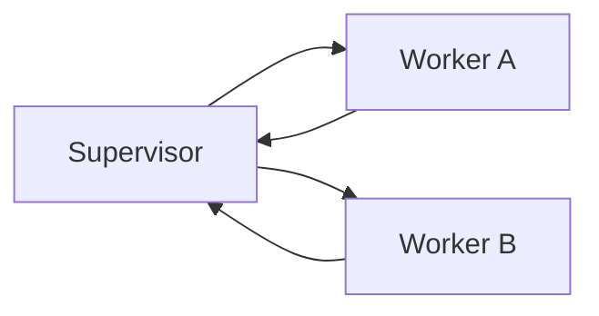

# 08: Two-agent topologies

After this page you can name hub-and-spoke, a tree, a peer handoff, and a bus. The labs implement supervisor-worker and a JSON handoff.

## Data
- Supervisor: one process that `asyncio.gather`s workers
- Worker: isolated prompt + own call
- Fan-out / fan-in: parallel calls, then join
- Swarm and Kafka buses are not in the labs

## Information
One agent saturates its context. Two agents split work. The supervisor keeps the goal; workers keep a narrow prompt.

## Knowledge
1. Pick a topology.
2. Give each worker a system prompt and no extra tools.
3. Join results in the supervisor.

## Wisdom
Two workers is enough. A gossip swarm is not this chapter.

## The When and Why
- **When:** one context cannot hold two specialist jobs without mixing them.
- **Why:** isolated prompts keep tools and instructions from leaking across roles.

## How it works

## Data contract
Worker return: `{ "role": "string", "output": "string" }`.

## Lab
- [lab1_supervisor_worker.py](./lab1_supervisor_worker.py) / [lab1_supervisor_worker.md](./lab1_supervisor_worker.md)

## Related
- **Single agent:** chapter 07. Use it until a second prompt is required.

## Notes
Keep one specialized-roles page. The duplicate `02_specialized_roles_*` file was dropped.
