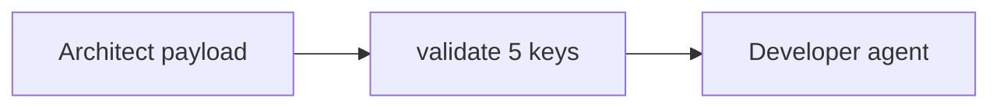

# 08: Handoff JSON

After this page an agent-to-agent message is a JSON object with five keys, not a paragraph.

## Data
- Keys: `context`, `content`, `action`, `state_dump`, `verification`
- Envelope: `protocol_version`, `correlation_id`, `handoff`
- Middleware: reject if a key is missing

## Information
Unstructured handoffs drift. A named object fails at validation before the next model call.

## Knowledge
1. Build the five keys.
2. Validate.
3. Recipient reads `action` and `content`.

## Wisdom
Five keys are enough. OTel `traceparent` is optional metadata, not a second protocol.

## The When and Why
- **When:** work must cross a process or role boundary.
- **Why:** a free-text handoff drops the test command or the checkpoint id.

## How it works



## Data contract
**Handoff**

```json
{
  "protocol_version": "2026-01-01",
  "correlation_id": "trace-1",
  "handoff": {
    "context": { "goal": "string" },
    "content": { "modified_code": "string" },
    "action": { "instruction": "string" },
    "state_dump": { "checkpoint_id": "string" },
    "verification": { "test_command": "string" }
  }
}
```

## Lab
- [lab2_agent_handoff.py](./lab2_agent_handoff.py) / [lab2_agent_handoff.md](./lab2_agent_handoff.md)

## Related
- **Chapter 02 JSON:** same `json.loads` habit, more keys.

## Notes
Real lab validates the five keys then calls the developer agent.
