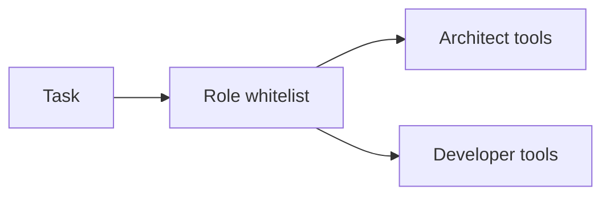

# 08: Specialized roles

After this page a role is a system prompt plus a tool whitelist. RBAC enforcement is the chapter 09 lab.

## Data
- Role: system prompt + allowed tool name list
- Example roles: Architect (`view_file`, `write_spec`), Engineer (`view_file`, `write_to_file`), Auditor (`view_file`, scoped `run_command`)

## Information
One agent with every tool mixes jobs. A role is a smaller grant.

## Knowledge
1. Write the system prompt with what the role must not do.
2. Attach only that role's tools.
3. Reject calls not on the list (chapter 09 implements the reject).

## Wisdom
Personas without a whitelist are just text. The list is the control.

## The When and Why
- **When:** two agents share a process and must not share every tool.
- **Why:** a doc writer with `run_command` is an accident.

## How it works

## Data contract
Grant: `dict[str, list[str]]` mapping role name to tool names.

## Lab
RBAC lab lives in [../09_the_shield/lab3_agent_rbac.md](../09_the_shield/lab3_agent_rbac.md).

## Related
- **Chapter 09:** the interceptor that enforces the list.

## Notes
Duplicate module file `02_specialized_roles_and_persona_design.md` was identical and was not kept.
