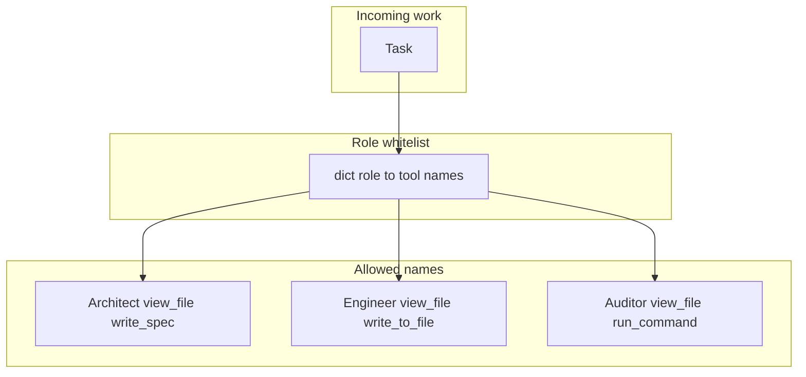

# 08: Specialized roles

After this page a role is a system prompt plus a tool whitelist. The chapter 08 labs isolate the prompt. The list is enforced in chapter 09 `lab3_agent_rbac.py`.

## Data
A **role** is two things stored together:

1. A system prompt. That is the `role: system` string, or the `system_prompt` argument in `lab1_supervisor_worker.py` (`worker_security_auditor` and `worker_doc_generator` each have their own).
2. An allowed tool name list. That is a Python dict from role name to a list of strings. The intended names in this chapter are Architect, Engineer, and Auditor.

Intended grants:

- Architect: `view_file`, `write_spec`
- Engineer: `view_file`, `write_to_file`
- Auditor: `view_file`, scoped `run_command`

The chapter 09 reference script uses different names (`ARCHITECT` / `read_file` / `list_dir`, `DEVELOPER` / `read_file` / `write_file`, `AUDITOR` / `read_file` / `run_tests`). The idea is the same: a role name maps to a short list. See Notes.

Lab 1 workers have a system prompt and no tools. Lab 2 `agent_developer` has a prompt and no whitelist. This page names the missing list so chapter 09 has something to enforce.

`OLLAMA_HOST` should default to `http://192.168.1.29:11434`. `OLLAMA_MODEL` should default to `qwen3.6:35b-a3b-65k`. A role does not change the route. The intended route is still `POST /api/chat`.

## Information
One agent with every tool mixes jobs. The writer can call `run_command`. The auditor can call `write_to_file`. A role is a smaller grant: the prompt says what the job is, and the list says which function names `TOOL_REGISTRY` may run.

Without the list, the prompt is only text. The model can still emit a `tool_calls` entry for a name that is not its job. Chapter 09 `rbac_tool_interceptor` is the function that compares `tool_name` to the list and returns status `403` when it is missing.

## Knowledge
1. Write the system prompt with what the role must do and what it must not do.
2. Attach only that role's tool names. Store them as `dict[str, list[str]]` (role name to tool names).
3. When a `tool_calls` item arrives, look up the role and reject any name that is not on the list. Chapter 09 implements the reject. This chapter only names the grant.
4. Do not put `run_command` on the writer. Do not put `write_to_file` on the auditor.
5. Do not implement Docker or a permission matrix here.

## Wisdom
Personas without a whitelist are just text. The list is the control. Two isolated prompts in lab 1 prove the topology. They do not prove a tool cannot leak. That proof is chapter 09.

## The When and Why
- **When:** two agents share a process and must not share every tool.
- **Why:** a doc writer with `run_command` is an accident. The list stops the call before the function runs.

## How it works



Walkthrough of a grant check (the idea; the function lives in chapter 09):

1. You pick a role name, for example Architect.
2. You look up that name in the grant dict. The intended list is `view_file` and `write_spec`.
3. The model emits a `tool_calls` item. If the name is `view_file`, the call is allowed. If the name is `run_command`, the interceptor returns `403` and the function does not run.
4. Lab 1 does not do this lookup. It only isolates the system prompt. Lab 2 does not do this lookup either.

The new fact is the list next to the prompt. The reject is chapter 09.

## Data contract

**Intended grant** `dict[str, list[str]]`

```json
{
  "Architect": ["view_file", "write_spec"],
  "Engineer": ["view_file", "write_to_file"],
  "Auditor": ["view_file", "run_command"]
}
```

**What chapter 09 `lab3_agent_rbac.py` actually stores**

```json
{
  "ARCHITECT": ["read_file", "list_dir"],
  "DEVELOPER": ["read_file", "write_file"],
  "AUDITOR": ["read_file", "run_tests"]
}
```

`rbac_tool_interceptor(agent_role, tool_name, tool_args)` returns `{ "status": 200, "result": "string" }` or `{ "status": 403, "error": "string" }`. See Notes.

## Lab
This page has no lab in chapter 08. The grant is named here. The reject is chapter 09.

- Module: [this file](./02_specialized_roles.md)
- Chapter 09 lab: [lab3_agent_rbac.py](../09_the_shield/lab3_agent_rbac.py) / [lab3_agent_rbac.md](../09_the_shield/lab3_agent_rbac.md) - `ROLE_TOOL_PERMISSIONS` plus `rbac_tool_interceptor`. Done when Architect `run_command` returns `403` and Developer `write_file` returns `200`.

## Related
- **Chapter 09:** the interceptor that enforces the list.
- **00_topologies.md:** lab 1 isolates prompts and does not attach a whitelist.
- **01_handoff_protocol.md:** the developer agent reads `action` and `content` with no tool list.

## Notes
- Duplicate module file `02_specialized_roles_and_persona_design.md` was identical and was not kept.
- Contract drift vs `../09_the_shield/lab3_agent_rbac.py`: role keys are `ARCHITECT`, `DEVELOPER`, `AUDITOR` (uppercase). Tool names are `read_file`, `list_dir`, `write_file`, `run_tests`. `run_command` exists in `TOOL_EXECUTORS` but is on no grant, so every role that calls it gets `403`. There is no model POST in that script. The intended teaching names on this page stay Architect / Engineer / Auditor with `view_file`, `write_spec`, `write_to_file`, and scoped `run_command`. Write the intended names in your copy. Leave the reference file as-is.
