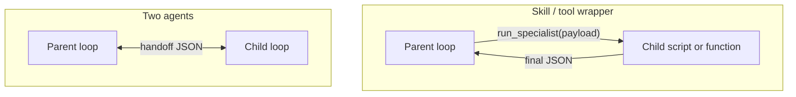

# Skill wrapper vs two agents

One new idea: a second agent is not the default. Most of the time the orchestrator should call a function and wait for a final JSON result.

## Data
Two shapes:

1. Skill / tool wrapper. The parent calls `run_specialist(payload)`. That function runs a script or an in-process loop to completion and returns one JSON object.
2. Two agents. Each has its own loop, its own message list, and a handoff JSON on a queue or bus.

## Information
Both isolate context. The parent never needs the child's raw trial-and-error tokens. The difference is whether the parent blocks and waits, or both loops stay alive and pass messages.

## Knowledge
1. If the child can finish alone (retries, checks, one deliverable), wrap it as a tool. See [03_the_dispatcher](../03_the_dispatcher/).
2. If the child must stay up, or the parent must approve a mid-run artifact, use two agents and a handoff contract. See the labs in this folder.
3. A common production shape is both: the parent sees one skill. Inside that skill, a full child loop runs.

## Wisdom
Do not stand up a message bus because you have two job titles. A function call is enough until you need mid-run inspection or overlapping work.

## The When and Why
- **When (skill):** the task is self-contained. The parent only needs the final payload. You want a simple stack trace.
- **When (two agents):** the parent must watch, correct, or approve work while it is still running, or two loops must run at the same time (watcher vs doer).
- **Why:** a bus adds routing, serialization, and failure modes. Skip it until a skill wrapper cannot do the job.

## How it works



Skill path: parent emits a tool call, waits, reads one result, continues.

Two-agent path: parent writes a handoff object (`context`, `content`, `action`, `state_dump`, `verification`). The child starts a new loop from that object.

## Data contract

Skill result (minimum):

```json
{
  "status": "ok",
  "deliverable": {}
}
```

Handoff (minimum):

```json
{
  "context": "string",
  "content": "string",
  "action": "string",
  "state_dump": {},
  "verification": "string"
}
```

## Lab
Use the labs in this folder for the two-agent path. A skill wrapper is the dispatcher from chapter 03 with a longer function body.

## Related
- **Subprocess / function call:** the skill wrapper. Lowest overhead.
- **Queue (Redis list, in-memory list):** enough for two agents on one machine.
- **Kafka / RabbitMQ:** same job when you have many workers or you must not drop messages. Not required for the labs.

## Notes
The decision is the same with any parent and specialist. A second agent is a choice, not a default.
