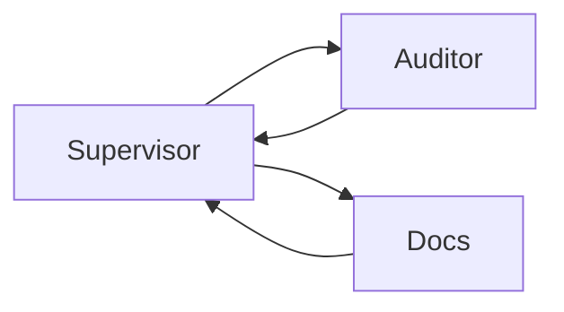

# Lab 1: Supervisor-worker

After this lab two workers run in parallel and the supervisor prints both reports.

## Data
- Script: `lab1_supervisor_worker.py`
- Workers: security auditor, doc generator
- Join: `asyncio.gather`

## Information
Fan-out two POSTs. Fan-in the strings.

## Knowledge
1. Define two worker coroutines.
2. `gather` them.
3. Print both outputs.

## Wisdom
This is not a Kafka bus.

## The When and Why
- **When:** one prompt cannot be both auditor and writer without mixing.
- **Why:** two isolated calls prove the topology.

## How it works



## Data contract
Worker dict: `{ "role": "string", "output": "string" }`.

## Run

```bash
python education/08_two_agents/lab1_supervisor_worker.py
```

## What you should see
Two role headers and a duration. SQL-injection sample code is the input.

## What this becomes later
Chapter 09 isolates their tools.

## Related
- **asyncio.gather:** the fan-out primitive.

## Notes
Workers share no message list.
