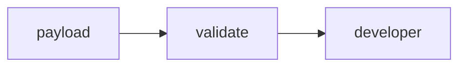

# Lab 2: Agent handoff

After this lab a five-key JSON object is validated and a second agent reads it.

## Data
- Script: `lab2_agent_handoff.py`
- Required keys: context, content, action, state_dump, verification

## Information
Architect builds the object. Middleware checks keys. Developer uses `action` and `content`.

## Knowledge
1. `create_a2a_handoff_payload`.
2. `validate_handoff_middleware`.
3. Developer POST.

## Wisdom
Do not add Jaeger here.

## The When and Why
- **When:** work crosses a role boundary.
- **Why:** missing keys must fail before the next POST.

## How it works



## Data contract
See the module JSON.

## Run

```bash
python education/08_two_agents/lab2_agent_handoff.py
```

## What you should see
`HANDOFF_COMPLETED` and a correlation id. Missing key raises `ValueError`.

## What this becomes later
Chapter 09 can refuse the developer tools.

## Related
- **correlation_id:** string you generate; OTel is optional.

## Notes
Schema check is five `in` tests, not Pydantic.
