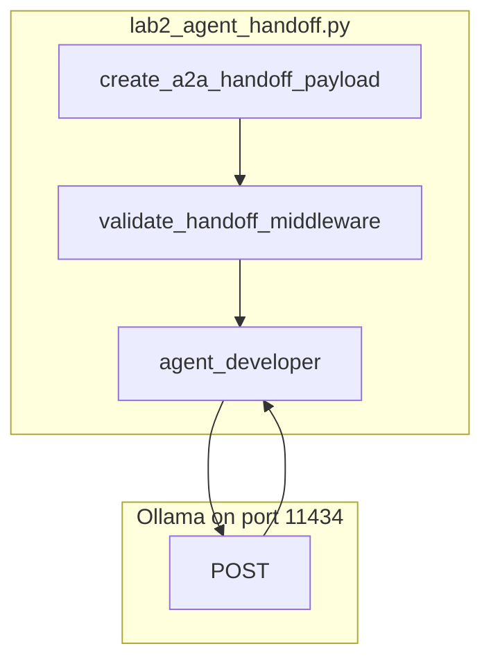

# Lab 2: Agent handoff

A five-key JSON object is validated and a second agent reads it.

## What you touch
- Script: `lab2_agent_handoff.py`
- Functions: `create_a2a_handoff_payload`, `validate_handoff_middleware`, `agent_developer`
- Envelope keys: `protocol_version`, `correlation_id`, `handoff`
- Required keys under `handoff`: `context`, `content`, `action`, `state_dump`, `verification`
- Nested keys the developer reads: `action.instruction`, `content.modified_code`, `context.goal`, `verification.test_command`
- Sample `modified_code` in `__main__`: `query = 'SELECT * FROM users WHERE id=' + user_id`
- Intended URL: `{OLLAMA_HOST}/api/chat` (default host `http://192.168.1.29:11434`)
- Reference URL: hardcoded `http://192.168.1.29:11434/api/generate` (see Notes)
- Intended model: `OLLAMA_MODEL` default `qwen3.6:35b-a3b-65k`

## Steps


1. Read `OLLAMA_HOST` and `OLLAMA_MODEL` from the environment. If they are unset, use `http://192.168.1.29:11434` and `qwen3.6:35b-a3b-65k`.
2. Write `create_a2a_handoff_payload`. It returns `{ "protocol_version": "2026-01-01", "correlation_id", "handoff": { context, content, action, state_dump, verification } }`. Nested objects: `context.goal`, `content.modified_code`, `action.instruction`, `state_dump.checkpoint_id`, `verification.test_command`.
3. Write `validate_handoff_middleware(payload)`. Loop the five keys on `payload["handoff"]`. If one is missing, raise `ValueError`. If all are present, return `True`.
4. Write `agent_developer(payload)`. Read `action.instruction` and `content.modified_code`. Intended POST: `model`, `messages`, `stream: false`, `options.temperature: 0.0` to `{host}/api/chat`. Read assistant `content` (or `response` on the reference route) into `verified_code`.
5. Return `{ "correlation_id", "status": "HANDOFF_COMPLETED", "verified_code", "verification_result": "PASSED" }`.
6. In `__main__`, build a payload for the SQL concatenation snippet, `action_instruction` to parameterize the query, `state_checkpoint` `chk_db_opt_001`, and `verification_cmd` `pytest tests/test_sql_security.py`. Validate, then call `agent_developer`. Print the return object with `json.dumps`.
7. Confirm `HANDOFF_COMPLETED` and a `correlation_id` print. A missing key must raise before the POST. If the host is unreachable, print the error and exit. Do not retry. Do not add Jaeger or Pydantic.

## Data contract
Intended keys this lab should send and read. The reference file differs (Notes).

**Handoff envelope**

```json
{
  "protocol_version": "2026-01-01",
  "correlation_id": "trace-1",
  "handoff": {
    "context": { "goal": "string", "environment": "string" },
    "content": { "modified_code": "string" },
    "action": { "instruction": "string", "deliverable": "string" },
    "state_dump": { "checkpoint_id": "string", "active_branch": "string" },
    "verification": { "test_command": "string", "expected_exit_code": 0 }
  }
}
```

**Intended developer request** `POST /api/chat`

```json
{
  "model": "qwen3.6:35b-a3b-65k",
  "messages": [
    { "role": "system", "content": "string" },
    { "role": "user", "content": "string" }
  ],
  "stream": false,
  "options": { "temperature": 0.0 }
}
```

**Developer return**

```json
{
  "correlation_id": "trace-1",
  "status": "HANDOFF_COMPLETED",
  "verified_code": "string",
  "verification_result": "PASSED"
}
```

**Reference script request** `POST /api/generate`

```json
{
  "model": "qwen3.6:35b-a3b-65k",
  "prompt": "You are a Developer Agent.\nContext: ...\nTask: ...\nCode:\n...",
  "stream": false,
  "options": { "temperature": 0.0 }
}
```

It reads `response` only.

## Run
Copy `.env.example` to `.env` in the repo root and uncomment the Ollama lines. The script loads that file (it does not override vars already set in the shell).

From the repo root:

```bash
python education/08_two_agents/lab2_agent_handoff.py
```

```powershell
python education/08_two_agents/lab2_agent_handoff.py
```

## What you should see
`=== STARTING 5-COMPONENT AGENT HANDOFF LAB ===`. `[MIDDLEWARE] Schema Validated!` and a `Correlation ID`. `=== DEVELOPER AGENT RECEIVED HANDOFF ===` with goal, action, and `pytest tests/test_sql_security.py`. Then `=== FINAL VERIFIED HANDOFF RESULT ===` with `"status": "HANDOFF_COMPLETED"` and `"verification_result": "PASSED"`. If a required key is missing, `ValueError` prints and there is no POST. If you see `URLError`, the provider is not reachable at the hardcoded host.

## Stop here
Do not add Jaeger, a `traceparent` parser, or Pydantic. Do not run the pytest command for real. Chapter 09 can refuse the developer tools. This lab is the five keys plus one POST.

## Notes
- Schema check is five `in` tests, not Pydantic.
- Contract drift vs `lab2_agent_handoff.py`: host and model are literals (`OLLAMA_URL`, `MODEL_NAME`), not env. Route is `/api/generate`. No `messages` key. The architect is inline in `__main__`, not a second kernel. `verification.test_command` is printed but not executed (`Exit Code: 0 (PASSED)` is a constant). The intended contract is a five-key `handoff` object that fails closed before the next POST. Write that in your copy. Do not edit the `.py` in the repo.
