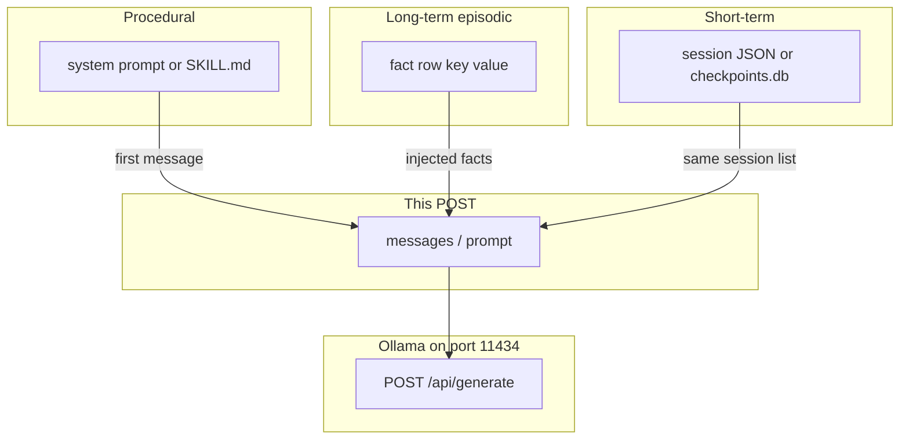

# 09: Agentic memory

After this chapter you can name four stores and say which one a fact belongs in. Working, short-term, long-term (episodic), and procedural are different files or tables. This page does not put all four in one script.

## Data
Four stores. They are not the same object.

**Working memory** is this POST. It is the `messages` list (or the `prompt` string) you send to `{OLLAMA_HOST}/api/generate` or `/v1/chat/completions` right now. Chapter 00 in this folder shrinks that list. When the process exits, working memory is gone unless you wrote it somewhere else.

**Short-term / session memory** is the session list on disk. Chapter 05 writes it as JSON or as a row in `checkpoints.db`. One session, one thread_id. A new session starts a new list.

**Long-term / episodic memory** is facts that must survive a new session. A fact is a small row: `{ "key": "string", "value": "string" }`. The store can be a SQLite table or a vector collection. You write after a session. You read at the start of a later session and inject matching rows into `messages`. Lab 2 writes one row to `facts.json`: `{ "key": "preferred_name", "value": "Ada" }`.

**Procedural memory** is how to do a job, not what happened. It lives in the system prompt (`role: "system"`, key `content`) or in a `SKILL.md` file (chapter 14). You load it every run. You do not treat it as a fact row. Lab 2 keeps `You add numbers. Show each step.` in system `content` only.

Lab 2 is `lab1_episodic_vs_procedural.py`. Functions: `save_fact`, `load_facts`, `route_query`. Two queries print which store they hit. Lab 2 does not POST.

This file was moved from modules/14. Leftover notes from old 01/03 folders live here. The four names did not change.

`OLLAMA_HOST` should default to `http://192.168.1.29:11434`. `OLLAMA_MODEL` should default to `qwen3.6:35b-a3b-65k`. Memory writes do not require a POST. A POST happens only when you ask the model to use a loaded fact.

## Information
Do not put all four stores in one file. A bug in the session JSON is not a bug in the fact table. A bad system prompt is not a missing episodic row.

The session file is not long-term memory. If you only `json.dump` the `messages` list, a new session with a new path or a new `thread_id` will not see last week's facts.

Episodic means "what happened" or "what is true about this user or project": a key/value you can look up later. Procedural means "how we do this job": the steps in the system prompt or in `SKILL.md`.

Vector RAG (`02_private_rag.md`, `lab2_local_private_rag.py`) is one way to store long-term text. It is not the only way. A SQLite table of `{ "key", "value" }` is enough to prove cross-session facts. Lab 2 uses `facts.json`.

## Knowledge
1. Decide which store the item belongs in before you write.
2. Working: append to `messages` and POST. Do not open a DB for one turn.
3. Short-term: `json.dump` / `json.load` or `save_checkpoint` / `load_latest_checkpoint` from chapter 05. Same session only.
4. Long-term / episodic: INSERT a fact row `{ "key": "string", "value": "string" }`. On a later run, SELECT (or embed-and-query) and prepend matching values into `messages`.
5. Procedural: edit the system `content` string or a `SKILL.md`. Load it as the first message every run. Do not INSERT it as a fact.
6. Write and read that store only. Do not merge the four into one class on this page.

## Wisdom
A JSON session file is enough until a fact must survive a new session. Then add one fact table (or one vector collection). Do not add all four stores, a skill loader, and RAG in the same script. If you do, you will not know which store a missing fact came from.

## The When and Why
- **When:** a fact must survive a new session, or you need to separate "what happened" from "how we do the job".
- **Why:** the session file is not long-term memory. The system prompt is not a fact row. Mixing them hides which store failed.

## How it works



Walkthrough of one fact that must survive a new session:

1. Session A finishes. You INSERT `{ "key": "preferred_name", "value": "Ada" }` into a SQLite table or a JSON facts file. That is episodic write.
2. Session B starts with a new `messages` list. You SELECT (or load) that row and insert a system or user message that states the fact.
3. You POST `{ "model": "...", "messages": [...] }` to `{OLLAMA_HOST}/api/generate` or `/v1/chat/completions`.
4. Procedural text (the job instructions) was already in the system `content` or in `SKILL.md`. It was not the fact row.

Walkthrough of lab 2:

1. `save_fact` writes `{ "key": "preferred_name", "value": "Ada" }` to `facts.json`.
2. Session B starts a new `messages` list with only `{ "role": "system", "content": "You add numbers. Show each step." }`.
3. `route_query("What is the preferred name?")` returns `{ "store": "episodic", "row": ... }`.
4. `route_query("How do I add numbers?")` returns `{ "store": "procedural", "content": ... }`.
5. No POST. No vector search.

Nothing in that walkthrough embeds a document corpus. That is `02_private_rag.md`.

## Data contract

**Fact row** (episodic, intended)

```json
{ "key": "string", "value": "string" }
```

**Lab 2 fact row**

```json
{ "key": "preferred_name", "value": "Ada" }
```

**Working POST** (after you inject facts and the system prompt)

```json
{
  "model": "qwen3.6:35b-a3b-65k",
  "messages": [
    { "role": "system", "content": "string" },
    { "role": "user", "content": "string" }
  ]
}
```

Lab 2 does not POST. It prints `{ "store": "episodic" }` or `{ "store": "procedural" }`.

## Lab
Done when the name query hits the fact row and the how-to query hits the system `content`.

- Module: [this file](./01_agentic_memory.md)
- Lab 2: [lab1_episodic_vs_procedural.md](./lab1_episodic_vs_procedural.md) - write `lab1_episodic_vs_procedural.py`. One fact row vs system `content`. Done when `route_query` prints `episodic` then `procedural`.
- Lab 3 (this folder): [lab2_local_private_rag.py](./lab2_local_private_rag.py) / [lab2_local_private_rag.md](./lab2_local_private_rag.md) - vector RAG, not the four-store split.

## Related
- **Chapter 05 checkpoints:** short-term persistence. Same session, not cross-session facts.
- **00_context_engine.md:** shrinks working memory. Does not add a fact table.
- **02_private_rag.md:** one long-term store (vectors). Not procedural memory.
- **Chapter 14 SKILL.md:** procedural files. Not fact rows.

## Notes
- Leftover memory notes from old 01/03 folders live here. The four names are the idea.
- Lab 2 has no reference `.py` yet. Do not treat lab 3 as that lab. Do not edit the `.py` files in the repo.
