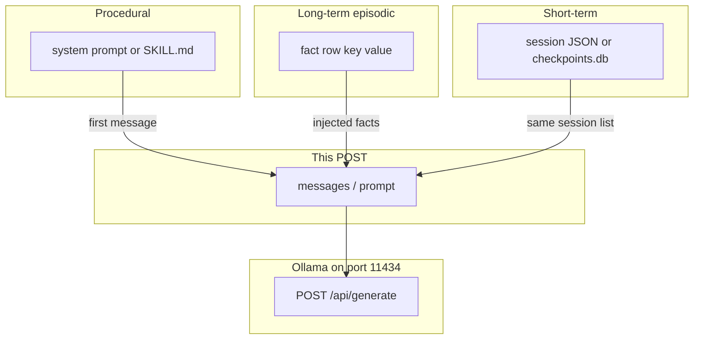

# 09: Agentic Memory: Working, Session, Episodic, and Procedural Memory

By the end of this chapter, you will understand the four distinct tiers of agentic memory and know exactly which storage mechanism is appropriate for each type of information.

In Chapter 08, we managed in-context working memory. In this chapter, we explore how agents retain persistent cross-session facts and procedural instructions over time.

## Data
We define four distinct memory layers:
1. **Working Memory**: The ephemeral `messages` list currently in RAM sent in the immediate model request. Cleared when the process ends.
2. **Short-Term / Session Memory**: Conversation history for a specific ongoing session, persisted to disk (e.g. `messages.json` or SQLite `checkpoints.db` tagged by `thread_id`).
3. **Long-Term / Episodic Memory**: Discrete facts and user preferences that survive across sessions (e.g. `{ "key": "preferred_name", "value": "Ada" }`), stored in a persistent database or facts file.
4. **Procedural Memory**: Behavioral instructions on *how* tasks must be executed (e.g. the system prompt instructions or a `SKILL.md` file), loaded on every run.

## Information
Separating memory into four distinct stores prevents architectural confusion:
- **Procedural rules** describe workflow steps (e.g. "Always validate input before processing"). They belong in system prompts, not individual fact rows.
- **Episodic facts** describe specific data points learned from interactions (e.g. "User prefers dark mode"). They are retrieved and injected into working memory when relevant.

## Knowledge
Here is the step-by-step procedure:
1. Categorize incoming information into the appropriate memory tier before writing.
2. Store cross-session facts in an episodic repository (`facts.json` or a relational table).
3. Maintain procedural guidelines in system prompts or skill definition documents.
4. Implement a routing query function `route_query(query, facts, procedural_content)` to fetch information from the correct memory store based on intent.

## Wisdom
Keeping memory stores modular makes debugging easy. A corrupt fact entry won't break your procedural prompt, and a new session ID cleanly resets short-term memory without losing long-term user preferences.

## The When and Why
- **When**: Use tiered memory when building personalized assistants, long-lived autonomous agents, or multi-session workflows.
- **Why**: Bundling all history and instructions into a single prompt is expensive and brittle. Categorizing memory ensures facts survive across sessions while maintaining lean working context.

## How it works



Walkthrough of one fact that must survive a new session:

1. Session A finishes. You INSERT `{ "key": "preferred_name", "value": "Ada" }` into a SQLite table or a JSON facts file. That is episodic write.
2. Session B starts with a new `messages` list. You SELECT (or load) that row and insert a system or user message that states the fact.
3. You POST `{ "model": "...", "messages": [...] }` to `{OLLAMA_HOST}/api/generate` or `/v1/chat/completions`.
4. Procedural text (the job instructions) was already in the system `content` or in `SKILL.md`. It was not the fact row.

Walkthrough of lab 2:

1. `save_fact` writes `{ "key": "preferred_name", "value": "Ada" }` to `facts.json`.
2. Session B starts a new `messages` list with only `{ "role": "system", "content": "You add numbers. Show each step." }`.
3. `route_query("What is the preferred name?")` returns `{ "store": "episodic", "row": ... }`.
4. `route_query("How do I add numbers?")` returns `{ "store": "procedural", "content": ... }`.
5. No POST. No vector search.

Nothing in that walkthrough embeds a document corpus. That is `02_private_rag.md`.

## Data contract

**Fact row** (episodic, intended)

```json
{ "key": "string", "value": "string" }
```

**Lab 2 fact row**

```json
{ "key": "preferred_name", "value": "Ada" }
```

**Working POST** (after you inject facts and the system prompt)

```json
{
  "model": "qwen3.6:35b-a3b-65k",
  "messages": [
    { "role": "system", "content": "string" },
    { "role": "user", "content": "string" }
  ]
}
```

Lab 2 does not POST. It prints `{ "store": "episodic" }` or `{ "store": "procedural" }`.

## Lab
Done when the name query hits the fact row and the how-to query hits the system `content`.

- Module: [this file](./01_agentic_memory.md)
- Lab 2: [lab1_episodic_vs_procedural.md](./lab1_episodic_vs_procedural.md) - write `lab1_episodic_vs_procedural.py`. One fact row vs system `content`. Done when `route_query` prints `episodic` then `procedural`.
- Lab 3 (this folder): [lab2_local_private_rag.py](./lab2_local_private_rag.py) / [lab2_local_private_rag.md](./lab2_local_private_rag.md) - vector RAG, not the four-store split.

## Related
- **Chapter 05 checkpoints:** short-term persistence. Same session, not cross-session facts.
- **00_context_engine.md:** shrinks working memory. Does not add a fact table.
- **02_private_rag.md:** one long-term store (vectors). Not procedural memory.
- **Chapter 14 SKILL.md:** procedural files. Not fact rows.

## Notes
- Leftover memory notes from old 01/03 folders live here. The four names are the idea.
- Lab 2 has no reference `.py` yet. Do not treat lab 3 as that lab. Do not edit the `.py` files in the repo.
