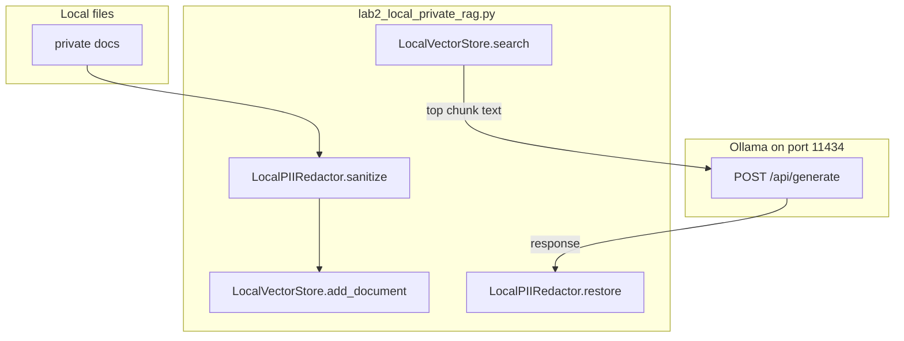

# 09: Private RAG: Local Retrieval and In-Flight PII Redaction

By the end of this chapter, you will build a completely local, air-gapped Retrieval-Augmented Generation (RAG) pipeline that retrieves relevant context chunks from local documents and redacts personally identifiable information (PII) before model generation.

In Chapter 08, we shrunk conversation history. In this chapter, we augment model prompts with external document chunks without sending private data to external cloud APIs.

## Data
A private RAG pipeline operates on three core primitives:
1. **Document Chunks**: Small text segments extracted from local files:
   `{"text": "string", "source": "path/to/doc.txt"}`.
2. **Local Vector / Keyword Index**: An in-memory or on-disk search index mapping query terms to the most relevant document chunks.
3. **In-Flight PII Redactor**: A privacy filter that replaces sensitive identifiers (names, emails, SSNs) with masked tokens (e.g. `[PERSON_1]`, `[EMAIL_1]`) prior to embedding or prompting, storing the mapping in an internal vault dictionary to restore original values in the final rendered response.

## Information
Retrieval-Augmented Generation bridges the gap between static model weights and local private datasets:
- Instead of fine-tuning or uploading confidential files to third-party providers, the application searches local files and injects only the relevant text chunks into the prompt context.
- In-flight PII redaction guarantees that sensitive names and addresses never touch inference logs or external servers.

## Knowledge
Here is the step-by-step procedure:
1. Load local documents and split them into distinct text chunks.
2. Pass chunks through `LocalPIIRedactor.sanitize()` to tokenize names and emails into placeholders.
3. Index the sanitized chunks in `LocalVectorStore`.
4. Sanitize the incoming user query and retrieve top matching chunks.
5. Format the prompt with the retrieved context:
   `Context: {chunk_text}\nQuestion: {sanitized_query}\nAnswer in 1 sentence:`
6. Send the request to `{OLLAMA_HOST}/api/generate`.
7. Pass the generated text through `LocalPIIRedactor.restore()` to substitute original entities back into the final answer.

## Wisdom
Keeping embedding, indexing, and inference entirely on your local machine ensures complete data privacy for enterprise and personal applications.

## The When and Why
- **When**: Use local RAG whenever an AI application requires answers grounded in private files, medical records, or proprietary documentation.
- **Why**: Language models hallucinate when answering questions about private data they were not trained on. Local RAG provides accurate, cited answers while keeping sensitive data secure.

## How it works



Walkthrough of one query:

1. `run_airgapped_private_rag` sanitizes each document and calls `add_document`.
2. It sanitizes the query and calls `search`. The top `content` string is the context.
3. It POSTs `{ "model": "...", "prompt": "Context: ...\\nQuestion: ...", "stream": false, "options": { "temperature": 0.0 } }` to `{OLLAMA_HOST}/api/generate`.
4. It reads `data["response"]` and runs `restore` so `[PERSON_1]` becomes the original name in the printed line.

Nothing in that walkthrough calls a cloud embed URL. The new work is retrieve, stuff, generate.

## Data contract

**Intended chunk**

```json
{ "text": "string", "source": "path" }
```

**Request** `POST /api/generate`

```json
{
  "model": "qwen3.6:35b-a3b-65k",
  "prompt": "Context: {chunk text}\\nQuestion: {query}\\nAnswer in 1 sentence:",
  "stream": false,
  "options": { "temperature": 0.0 }
}
```

**Response**

```json
{
  "response": "string"
}
```

The printed string is `restore(response)`, not the raw `response`.

## Lab
Done when a local chunk is in the prompt and the printed answer matches that chunk after PII restore.

- Module: [this file](./02_private_rag.md)
- Lab 2: [lab2_local_private_rag.py](./lab2_local_private_rag.py) / [lab2_local_private_rag.md](./lab2_local_private_rag.md) - redact, index, retrieve, POST, restore. Done when the diagnosis line is printed with the original name.

## Related
- **Chapter 00 POST:** the generate step. This page adds retrieve-and-stuff.
- **00_context_engine.md:** shrinks the list you already have. Does not read files.
- **03_codebase_indexing.md:** same retrieve idea on a repo.

## Notes
- Moved from labs/07 lab3 and modules/07/02.
- Contract drift vs `lab2_local_private_rag.py`: no `OLLAMA_HOST` / `OLLAMA_MODEL` read (URL and model are literals). Documents are hardcoded strings, not files. Store items are `{ "id", "content" }`, not `{ "text", "source" }`. `search` scores word overlap and returns the top 1 `content` string. There is no `source` path in the prompt or the printout. The intended contract is still `{ "text", "source" }` chunks from local files, then POST. Write that in your copy. Leave the reference file as-is.
