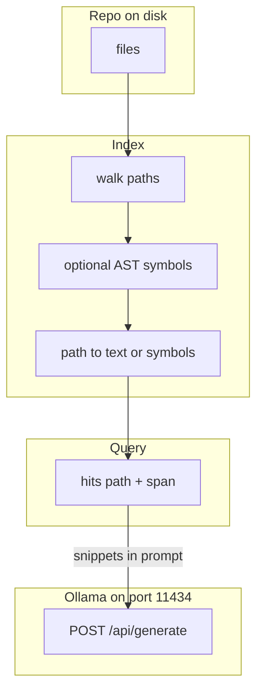

# 09: Codebase Indexing: File Trees and Abstract Syntax Tree (AST) Search

By the end of this chapter, you will implement an automated codebase indexer that scans a project directory, extracts symbol definitions (`def`, `class`), and returns targeted line spans to supply precise context to your agent.

In Chapter 02, we retrieved document chunks. In this chapter, we adapt retrieval techniques to navigate source code repositories efficiently without sending entire codebases to the model.

## Data
A codebase indexer structures source trees into searchable records:
- **Repository Traversal**: Systematically iterating over project directories while ignoring build artifacts, binaries, and `.git` folders.
- **Symbol Extraction (AST Parsing)**: Extracting structural identifiers (function names, class definitions) from source files.
- **Codebase Index Record**: A structured representation of a file:
  `{"path": "string", "text": "string", "symbols": ["name1", "name2"]}`.
- **Search Hit Result**: A precise reference matching a query:
  `{"path": "string", "span": "start_line:end_line"}`.

## Information
Feeding an entire codebase into an LLM context window quickly exhausts token budgets and slows down execution.

By building a lightweight index:
- Agents can query specific symbol names (e.g. `run_airgapped_private_rag`) or keyword patterns.
- The index returns only the relevant file paths and line ranges, enabling targeted prompt construction.

## Knowledge
Here is the step-by-step procedure:
1. Walk directory trees using `iter_files()`, skipping `.git` and non-code files.
2. Read each file and extract defined function and class names using lightweight string parsing or Python's `ast` module.
3. Store records in an in-memory index dictionary.
4. When queried, match terms against file text and symbols to produce exact `{ "path", "span" }` location hits.

## Wisdom
Fast substring search and symbol indexing (similar to tools like ripgrep) provide effective codebase navigation without requiring complex language server plugins.

## The When and Why
- **When**: Use codebase indexing when building coding assistants, repository exploration agents, or automated refactoring tools.
- **Why**: Language models work best when given focused, relevant code snippets rather than raw, unorganized file trees.

## How it works



Walkthrough of one "find this function" query:

1. You walk the repo and store each path plus its text (or its `def` / `class` names).
2. You query for a name such as `run_airgapped_private_rag`.
3. You get hits `{ "path": "education/09_agentic_memory_and_rag/lab2_local_private_rag.py", "span": "66:104" }` (line range or snippet).
4. You put those spans in `prompt` and POST to `{OLLAMA_HOST}/api/generate`.

Walkthrough of lab 4:

1. `iter_files` walks this folder and yields `.py` and `.md` paths.
2. `index_file` stores `text` and `def` / `class` names.
3. `search_index(..., "run_airgapped_private_rag")` prints at least one `HIT` whose path ends with `lab2_local_private_rag.py`.
4. `span` is `N:N` for the matching line. No POST.

Nothing in that walkthrough redacts PII or opens Chroma. The new work is the tree and the hit.

## Data contract

**Intended hit**

```json
{ "path": "string", "span": "string" }
```

**Request after retrieve** `POST /api/generate`

```json
{
  "model": "qwen3.6:35b-a3b-65k",
  "prompt": "Context: {path}:{span}\\nQuestion: {query}",
  "stream": false,
  "options": { "temperature": 0.0 }
}
```

Lab 4 prints the hit and does not POST. The intended contract is still a hit with `path` and `span`.

## Lab
Done when a query for `run_airgapped_private_rag` prints at least one `HIT` with `path` and `span`.

- Module: [this file](./03_codebase_indexing.md)
- Lab 4: [lab3_codebase_index.md](./lab3_codebase_index.md) - write `lab3_codebase_index.py`. Walk this folder. Done when `hit_count` is greater than 0 and a path ends with `lab2_local_private_rag.py`.
- Lab 3 (this folder): [lab2_local_private_rag.py](./lab2_local_private_rag.py) / [lab2_local_private_rag.md](./lab2_local_private_rag.md) - document RAG, not a repo walk.

## Related
- **ripgrep:** the simple sibling. `rg -n` already returns path and line.
- **02_private_rag.md:** same retrieve job on prose files, plus PII tokens.

## Notes
- Extra module page as specified. Moved from modules/16.
- Lab 4 has no reference `.py` yet. Do not treat lab 3 as the indexer lab. Do not edit the `.py` files in the repo.
