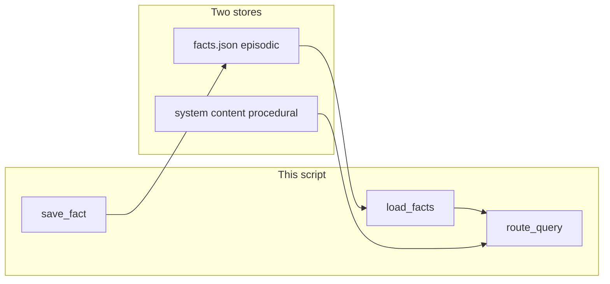

# Lab 1: Episodic vs procedural memory

One fact row is episodic. How-to text in the system `content` is procedural. A query prints which store it would hit. There is no vector DB and no HTTP.

## What you touch
- Script: `lab1_episodic_vs_procedural.py` (write it next to this brief; there is no reference `.py` yet)
- File: `facts.json` beside the script (`os.path.join(os.path.dirname(__file__), "facts.json")`)
- Fact row: `{ "key": "preferred_name", "value": "Ada" }`
- Procedural text: `{ "role": "system", "content": "You add numbers. Show each step." }`
- Functions: `save_fact(row)`, `load_facts()`, `route_query(query, facts, procedural_content)`
- Two queries in `__main__`: `What is the preferred name?` and `How do I add numbers?`
- No HTTP. This script does not read `OLLAMA_HOST` or `OLLAMA_MODEL`.
- No vector store. No window. No repo walk. Do not INSERT the system `content` as a fact.

## Steps


1. Set the path to `os.path.join(os.path.dirname(__file__), "facts.json")`.
2. Write `save_fact(row)`. Load the list if the file exists, else start `[]`. Append `row`. `json.dump` the list with `indent=2`. Print the path.
3. Write `load_facts()`. `json.load` the same path. If the file is missing, return `[]`.
4. Write `route_query(query, facts, procedural_content)`. Lowercase the query. For each fact, also build `key.replace("_", " ")`. If the query contains the `key`, that spaced key, or the `value` (case-insensitive), return `{ "store": "episodic", "row": that fact }`. Else if the query contains `how` or `step`, return `{ "store": "procedural", "content": procedural_content }`. Else return `{ "store": "none" }`.
5. In `__main__`, call `save_fact({ "key": "preferred_name", "value": "Ada" })`. That is session A. Start a new `messages` list for session B with only the procedural system item. Call `load_facts()`. Do not put the system `content` into `facts.json`.
6. Call `route_query("What is the preferred name?", facts, procedural_content)`. Print `query`, `store`, and `row`. Call `route_query("How do I add numbers?", facts, procedural_content)`. Print `query`, `store`, and `content`.
7. Confirm the first hit is `episodic` with `Ada`. Confirm the second hit is `procedural` with `Show each step`. Do not POST. Do not call `search`.

## Data contract
Only the keys this script writes and reads.

**facts.json**

```json
[
  { "key": "preferred_name", "value": "Ada" }
]
```

**Procedural system item** (not a fact row)

```json
{ "role": "system", "content": "You add numbers. Show each step." }
```

**Episodic hit**

```json
{ "store": "episodic", "row": { "key": "preferred_name", "value": "Ada" } }
```

**Procedural hit**

```json
{ "store": "procedural", "content": "You add numbers. Show each step." }
```

The script does not POST. Lab 3 is RAG. Chapter 14 is `SKILL.md`.

## Run
From the repo root:

```bash
python education/09_agentic_memory_and_rag/lab1_episodic_vs_procedural.py
```

```powershell
$env:OLLAMA_HOST="http://192.168.1.29:11434"
$env:OLLAMA_MODEL="qwen3.6:35b-a3b-65k"
python education/09_agentic_memory_and_rag/lab1_episodic_vs_procedural.py
```

This script ignores `OLLAMA_HOST` and `OLLAMA_MODEL`. They are listed so the lab Run block matches the other chapters. There is no HTTP call.

## What you should see
The path of `facts.json`. Then `query` `What is the preferred name?` with `store` `episodic` and `row` `{ "key": "preferred_name", "value": "Ada" }`. Then `query` `How do I add numbers?` with `store` `procedural` and `content` `You add numbers. Show each step.`. If both print `episodic`, the how-to string was written as a fact. If you see a retrieved chunk or `[PERSON_1]`, you opened lab 3. If you see a POST, you added HTTP this lab does not need.

## Stop here
This is two stores. Do not add a vector DB. Do not compact the list. Do not walk a repo. Do not load `SKILL.md` (chapter 14). Do not POST. Lab 1 is the window. Lab 3 is RAG. Lab 4 is symbol hits.

## Notes
- Write `lab1_episodic_vs_procedural.py` next to this brief. There is no reference `.py` in the repo yet.
- `facts.json` sits next to the script. Do not commit a huge dump.
- Keys written and read match this brief. Do not edit other `.py` files in the repo.
