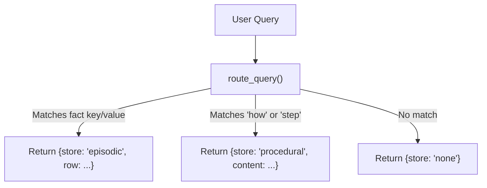

# Lab 1: Distinguishing Episodic Facts from Procedural Instructions

In this lab, you will implement memory persistence for cross-session episodic facts (`facts.json`) and a query router `route_query()` that directs questions to either episodic facts or procedural system instructions.

---

## What you touch
- Script to create: `lab1_episodic_vs_procedural.py`
- Main Functions:
  - `save_fact(row: dict)`
  - `load_facts() -> list`
  - `route_query(query: str, facts: list, procedural_content: str) -> dict`
- Episodic Fact Store: `facts.json` next to the script
- Procedural Prompt: System instruction string (`"You add numbers. Show each step."`)
- Pure Python logic (no network calls required)

---

## Steps


1. Set the episodic facts path to `os.path.join(os.path.dirname(__file__), "facts.json")`.
2. Implement `save_fact(row: dict)`:
   - Load existing facts if present; otherwise initialize `[]`.
   - Append `row` and save with `json.dump(..., indent=2)`.
3. Implement `load_facts() -> list`:
   - Read and return the deserialized fact list from `facts.json`.
4. Implement `route_query(query, facts, procedural_content)`:
   - Normalize `query` to lowercase.
   - For each fact, check if query contains `key`, spaced key (`key.replace("_", " ")`), or `value`. If matched, return `{"store": "episodic", "row": fact}`.
   - If query contains `"how"` or `"step"`, return `{"store": "procedural", "content": procedural_content}`.
   - Otherwise return `{"store": "none"}`.
5. In `__main__`:
   - Simulate Session A: Save fact `{"key": "preferred_name", "value": "Ada"}`.
   - Simulate Session B: Initialize fresh session with procedural prompt `"You add numbers. Show each step."` and load facts.
   - Route query `"What is the preferred name?"` -> verify `episodic` store match with `Ada`.
   - Route query `"How do I add numbers?"` -> verify `procedural` store match with the system prompt.

---

## Data contract

**Episodic Store: `facts.json`**

```json
[
  { "key": "preferred_name", "value": "Ada" }
]
```

**Procedural Prompt Payload**

```json
{
  "role": "system",
  "content": "You add numbers. Show each step."
}
```

**Router Return Shapes**

```json
// Episodic Match
{
  "store": "episodic",
  "row": { "key": "preferred_name", "value": "Ada" }
}

// Procedural Match
{
  "store": "procedural",
  "content": "You add numbers. Show each step."
}
```

---

## Run
From the repository root, run:

```bash
python education/09_agentic_memory_and_rag/lab1_episodic_vs_procedural.py
```

```powershell
python education/09_agentic_memory_and_rag/lab1_episodic_vs_procedural.py
```

---

## What you should see
- `facts.json` path printed upon saving.
- Query `"What is the preferred name?"` routing to `store: episodic` with `value: Ada`.
- Query `"How do I add numbers?"` routing to `store: procedural` with the calculation instructions.

---

## Stop here
You have successfully separated episodic facts from procedural instructions! In Lab 2, we will implement local private RAG with in-flight PII redaction.

Next up: [Lab 2: Local Private RAG](./lab2_local_private_rag.md).

---

## Notes
*(Record your memory routing results here)*

