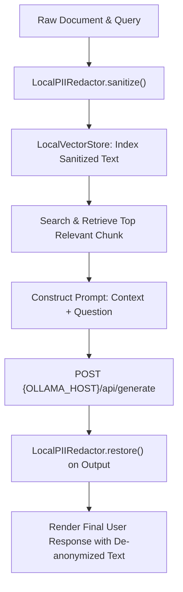

# Lab 2: Local Private RAG with In-Flight PII Redaction

In this lab, you will build a private Retrieval-Augmented Generation (RAG) pipeline that scrubs personally identifiable information (PII) before search and generation, injects relevant local document context, and restores real identities upon return.

---

## What you touch
- Script: `lab2_local_private_rag.py`
- Main Classes & Functions:
  - `LocalPIIRedactor.sanitize(text) -> str`
  - `LocalPIIRedactor.restore(text) -> str`
  - `LocalVectorStore.add_document(doc_id, content)`
  - `LocalVectorStore.search(query) -> str`
  - `run_airgapped_private_rag(query: str) -> str`
- URL / Endpoint: `{OLLAMA_HOST}/api/generate` (defaults to `http://127.0.0.1:11434/api/generate`)
- Request Keys: `model`, `prompt`, `stream` (`false`), `options.temperature` (`0.0`)
- Response Keys Read: `response`

---

## Steps


1. Read `OLLAMA_HOST` and `OLLAMA_MODEL` from environment variables, defaulting to `http://127.0.0.1:11434` and `llama3.2:1b`.
2. Define `LocalPIIRedactor` to replace names and emails with deterministic tokens (`[PERSON_1]`, `[EMAIL_1]`) and store reverse lookups in an internal vault.
3. Index local document records into `LocalVectorStore` after sanitization.
4. When a user asks a question (e.g. `"What is the diagnosis for John Doe?"`):
   - Sanitize the query to replace `"John Doe"` with `"[PERSON_1]"`.
   - Retrieve the top matching document chunk from `LocalVectorStore`.
   - Construct the prompt: `Context: {chunk}\nQuestion: {sanitized_query}\nAnswer in 1 sentence:`.
   - Send the POST request to `{OLLAMA_HOST}/api/generate`.
5. Run `LocalPIIRedactor.restore()` on the returned model response so the user sees real names restored without sending PII over the wire.

---

## Data contract

**Document Chunk Structure**

```json
{
  "text": "Patient [PERSON_1] (email: [EMAIL_1]) presented with mild hypertension.",
  "source": "medical_records/patient_101.txt"
}
```

**Generation Request Payload**

```json
{
  "model": "llama3.2:1b",
  "prompt": "Context: Patient [PERSON_1] (email: [EMAIL_1]) presented with mild hypertension.\nQuestion: What is the diagnosis for [PERSON_1]?\nAnswer in 1 sentence:",
  "stream": false,
  "options": { "temperature": 0.0 }
}
```

**Final Output**

```text
The diagnosis for John Doe is mild hypertension.
```

---

## Run
From the repository root, run:

```bash
python education/09_agentic_memory_and_rag/lab2_local_private_rag.py
```

```powershell
python education/09_agentic_memory_and_rag/lab2_local_private_rag.py
```

---

## What you should see
- Document sanitization logs showing original vs masked text (`[PERSON_1]`, `[EMAIL_1]`).
- Retrieved context chunk containing masked identifiers.
- Raw model response containing masked tokens.
- `[DE-ANONYMIZATION]` restored final result showing `John Doe` and his diagnosis accurately restored.

---

## Stop here
You have successfully implemented private local RAG! In Lab 3, we will build a codebase indexer to search repository files and symbols.

Next up: [Lab 3: Codebase Indexing](./lab3_codebase_index.md).

---

## Notes
*(Record your private RAG trace and restored answer here)*

