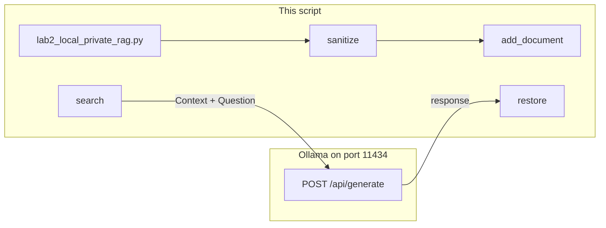

# Lab 2: Local private RAG

After this lab a local chunk is in the prompt and the printed answer uses the original name, not the mask token.

## What you touch
- Script: `lab2_local_private_rag.py`
- Functions: `LocalPIIRedactor.sanitize`, `LocalPIIRedactor.restore`, `LocalVectorStore.add_document`, `LocalVectorStore.search`, `run_airgapped_private_rag`
- URL / path: `{OLLAMA_HOST}/api/generate` (default `http://192.168.1.29:11434/api/generate`)
- Keys sent: `model`, `prompt`, `stream` (`false`), `options.temperature` (`0.0`)
- Keys read: `response`
- Intended chunk keys: `text`, `source`

## Steps


1. Read `OLLAMA_HOST` and `OLLAMA_MODEL` from the environment. If they are unset, use `http://192.168.1.29:11434` and `qwen3.6:35b-a3b-65k`.
2. Start with two local documents (intended: files on disk with `{ "text", "source" }`). The reference script uses two hardcoded strings: a patient note for John Doe and an admin note for Jane Smith.
3. Call `LocalPIIRedactor.sanitize` on each document. Emails become `[EMAIL_N]`. The names `John Doe`, `Jane Smith`, and `Alice Johnson` become `[PERSON_N]`. Store token to original in the vault dict.
4. Call `LocalVectorStore.add_document(doc_id, content)` with the sanitized text.
5. Sanitize the query `What is the diagnosis for John Doe?`. Call `search`. Take the top chunk.
6. Build `prompt` as `Context: {chunk}\nQuestion: {sanitized query}\nAnswer in 1 sentence:`.
7. POST `model`, `prompt`, `stream: false`, `options.temperature: 0.0` to `{host}/api/generate` with header `Content-Type: application/json`.
8. Read `data["response"]`. Print it as the masked output. Call `restore` and print the final line. The final line should contain `John Doe` and the diagnosis from the first document, not `[PERSON_1]`.

## Data contract
Only the keys this script sends and reads, plus the intended chunk.

**Intended chunk**

```json
{ "text": "string", "source": "path" }
```

**Request**

```json
{
  "model": "qwen3.6:35b-a3b-65k",
  "prompt": "Context: {chunk text}\\nQuestion: {query}\\nAnswer in 1 sentence:",
  "stream": false,
  "options": { "temperature": 0.0 }
}
```

**Response**

```json
{
  "response": "string"
}
```

The printed result is `restore(response)`.

## Run
Copy `.env.example` to `.env` in the repo root and uncomment the Ollama lines. The script loads that file (it does not override vars already set in the shell).

From the repo root:

```bash
python education/09_agentic_memory_and_rag/lab2_local_private_rag.py
```

```powershell
python education/09_agentic_memory_and_rag/lab2_local_private_rag.py
```

## What you should see
`=== STARTING AIR-GAPPED PRIVATE DATA RAG LAB ===`, then each document as Original and Sanitized. The first sanitized line should show `[PERSON_1]` and `[EMAIL_1]` in place of `John Doe` and `john@acme.com`. Then a retrieved context line, a raw model line that may still contain mask tokens, and `[DE-ANONYMIZATION] Restored Final Result for User:` with `John Doe` and mild hypertension. If you see `URLError` or connection refused, the provider is not reachable. If you see HTTP 404, the model name is wrong or not pulled. If the final line still has `[PERSON_1]`, `restore` did not run on `response`.

## Stop here
This is not a hosted vector service and not a codebase walker. Do not add Pinecone, a cloud embed API, or `os.walk` over a repo. Compaction is `00_context_engine.md`. Symbol hits are `03_codebase_indexing.md`. Do not copy this redactor into those pages.

## Notes
- Mechanism: redact, keyword-overlap search, POST, restore. `search` returns the top 1 `content` string.
- Contract drift vs `lab2_local_private_rag.py`: no `OLLAMA_HOST` / `OLLAMA_MODEL` read (URL and model are literals). Documents are hardcoded strings, not files. Store items are `{ "id", "content" }`, not `{ "text", "source" }`. There is no `source` path in the prompt or the printout. The intended contract is still `{ "text", "source" }` chunks from local files, then POST. Write that in your copy. Leave the reference file as-is.
