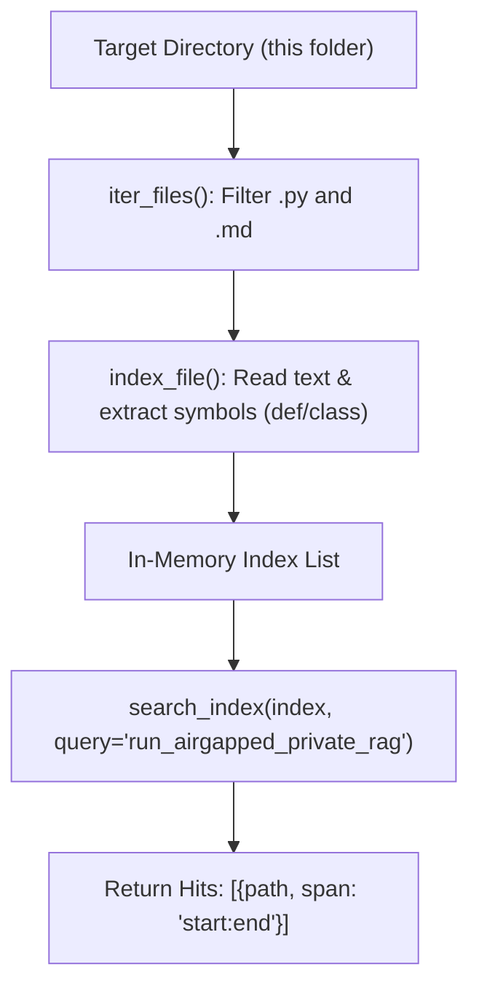

# Lab 3: Building a Codebase and Symbol Index

In this lab, you will write a filesystem scanner that walks source directories, parses function and class definitions into symbols, and performs substring queries returning exact file paths and line ranges (`path`, `span`).

---

## What you touch
- Script to create: `lab3_codebase_index.py`
- Target Directory: `os.path.dirname(__file__)` (this chapter folder)
- Main Functions:
  - `iter_files(root: str)`
  - `index_file(path: str) -> dict`
  - `search_index(index: list, query: str) -> list`
- Target Search Query: `"run_airgapped_private_rag"`
- Pure Python logic (no network calls required)

---

## Steps


1. Implement `iter_files(root: str)`:
   - Walk directories using `os.walk()`, skipping `.git` folders.
   - Yield file paths ending in `.py` or `.md`.
2. Implement `index_file(path: str) -> dict`:
   - Read file contents.
   - Scan for lines beginning with `def ` or `class ` to extract symbol names.
   - Return `{"path": path, "text": text, "symbols": [symbol_names]}`.
3. Implement `search_index(index: list, query: str) -> list`:
   - For each record, check lines containing `query` and format `span` as `f"{line_num}:{line_num}"` (1-indexed).
   - Return list of `{"path": path, "span": span}` hits.
4. In `__main__`:
   - Build index for `os.path.dirname(__file__)`.
   - Search for `"run_airgapped_private_rag"`.
   - Print each match with `HIT path=... span=...` and total `hit_count`.
   - Verify that at least one hit points to `lab2_local_private_rag.py`.

---

## Data contract

**Index Record Structure**

```json
{
  "path": "education/09_agentic_memory_and_rag/lab2_local_private_rag.py",
  "text": "...",
  "symbols": ["run_airgapped_private_rag"]
}
```

**Search Hit Result**

```json
{
  "path": "education/09_agentic_memory_and_rag/lab2_local_private_rag.py",
  "span": "66:66"
}
```

---

## Run
From the repository root, run:

```bash
python education/09_agentic_memory_and_rag/lab3_codebase_index.py
```

```powershell
python education/09_agentic_memory_and_rag/lab3_codebase_index.py
```

---

## What you should see
- One or more formatted `HIT path=... span=...` lines pointing to `lab2_local_private_rag.py`.
- `hit_count` greater than zero indicating successful file discovery and line matching.

---

## Stop here
You have successfully indexed codebase symbols and paths! In Chapter 10, we will build state graph orchestration and multi-node execution flows.

Next up: [Chapter 10: State Graphs and Router Orchestration](../10_state_graphs_and_routing/00_state_graphs_and_routing.md).

---

## Notes
*(Record your codebase indexing results and hit spans here)*

