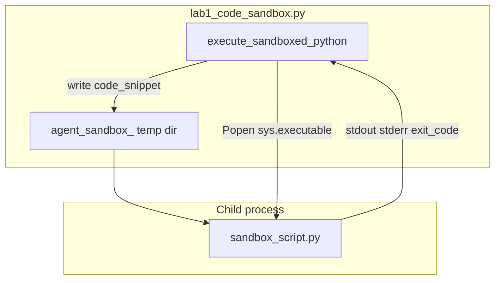

# 09: Sandbox

After this page untrusted code runs in a subprocess (or container) with limits, not in the agent process. The lab is `lab1_code_sandbox.py`.

## Data
A **sandbox** is a child process that runs a code string the model (or a test) handed you. The agent process must not `eval` or `exec` that string in its own PID.

**Isolation** in this lab is `subprocess.Popen`. Stricter isolation is Docker, gVisor, or Wasm. Those are the same job with a container runtime. This lab does not start a container.

**Limits** in the lab are:

- A temp directory from `tempfile.TemporaryDirectory(prefix="agent_sandbox_")`. The child `cwd` is that directory.
- A timeout. Default is `5.0` seconds. Test 3 uses `2.0`.
- Captured `stdout` and `stderr` pipes. The function returns those strings, not a live handle.

The function is `execute_sandboxed_python(code_snippet, timeout_seconds=5.0)`. It writes `sandbox_script.py` inside the temp dir and runs `[sys.executable, script_path]`.

This lab does not POST to Ollama. `OLLAMA_HOST` should still default to `http://127.0.0.1:11434` and `OLLAMA_MODEL` to `llama3.2:1b` when a later tool calls the model. Port `11434` is the Ollama listener.

## Information
The model can emit a Python snippet or a shell command. If you `exec` that string in the agent process, a bad line shares your memory, your open files, and your network. A child process dies when it finishes or when you kill it. The parent only sees `stdout`, `stderr`, and `exit_code`.

In-process `eval` is not a sandbox. A timeout that does not `process.kill()` is not a limit.

## Knowledge
1. Receive a code string. Do not run it with `eval` or `exec`.
2. Write it to a temp file (`sandbox_script.py` in an `agent_sandbox_` directory) or pass it on stdin.
3. Start a child with `subprocess.Popen`. Set `cwd` to the temp dir. Capture stdout and stderr.
4. Call `communicate(timeout=timeout_seconds)`. On `subprocess.TimeoutExpired`, `kill` the child.
5. Return `{ "stdout", "stderr", "exit_code" }` (the lab also adds `status` and `duration_seconds`).
6. Do not add Docker, gVisor, a network namespace, or a seccomp profile.

## Wisdom
A subprocess with a timeout is enough to prove the code left the agent PID. Docker, gVisor, and Wasm are the same job with stricter isolation. If you add them now, a timeout failure could come from the container runtime instead of `communicate`.

## The When and Why
- **When:** the model can emit a shell command or a Python snippet.
- **Why:** a bad command in the agent PID is your machine. A child process returns text and an exit code.

## How it works



Walkthrough of the three tests in `__main__`:

1. Valid code: `print('Calculating 15 * 3...'); result = 15 * 3; print(f'Result: {result}')`. The child exits 0. `status` is `COMPLETED`. `stdout` contains `Result: 45`.
2. Runtime error: `data = [1, 2, 3]; print(data[10])`. The child raises `IndexError`. `status` is `FAILED`. `stderr` holds the traceback. `exit_code` is not 0.
3. Infinite loop: `while True: time.sleep(0.1)` with `timeout_seconds=2.0`. `communicate` raises `TimeoutExpired`. The function kills the child and returns `status` `TIMEOUT_EXCEEDED`, `exit_code` `-1`.

The new fact is the child process. The parent never `exec`s the string.

## Data contract

**Intended return**

```json
{
  "stdout": "string",
  "stderr": "string",
  "exit_code": 0
}
```

**What the reference script actually returns**

```json
{
  "status": "COMPLETED",
  "exit_code": 0,
  "stdout": "string",
  "stderr": "string",
  "duration_seconds": 0.0
}
```

`status` is `COMPLETED` (exit 0), `FAILED` (nonzero exit), or `TIMEOUT_EXCEEDED` (killed). Timeout sets `exit_code` to `-1`. See Notes.

## Lab
Done when a valid snippet prints `stdout`, an error prints `stderr`, and a loop is killed.

- Module: [this file](./00_sandbox.md)
- Lab 1: [lab1_code_sandbox.py](./lab1_code_sandbox.py) / [lab1_code_sandbox.md](./lab1_code_sandbox.md) - `execute_sandboxed_python` on three snippets. Done when you see `COMPLETED`, `FAILED`, and `TIMEOUT_EXCEEDED`.
- Lab 2: [lab2_permissions.md](./lab2_permissions.md) - high-risk allowlist. After this page, before lab 3 RBAC and lab 4 HITL.
- Lab 3: [lab3_agent_rbac.md](./lab3_agent_rbac.md) - RBAC interceptor.
- Lab 4: [lab4_hitl_generative_ui.md](./lab4_hitl_generative_ui.md) - HITL pause.

## Related
- **Docker / gVisor / Wasm:** same job, a container runtime. Not in the lab.
- **01_security_overview.md:** sandbox is one control. The allowlist, RBAC, and HITL are the others.
- **subprocess:** the primitive. `Popen` plus `communicate(timeout=...)` plus `kill`.

## Notes
- Keep the existing lab facts: temp dir prefix `agent_sandbox_`, script name `sandbox_script.py`, three tests (valid, `IndexError`, infinite loop).
- Contract drift vs `lab1_code_sandbox.py`: return object adds `status` and `duration_seconds` on top of `stdout`, `stderr`, `exit_code`. No `OLLAMA_HOST` / `OLLAMA_MODEL` (this script does not POST). No CPU or memory cgroup. The child can still open the network; isolation is a temp `cwd` and a timeout. The intended contract is a child process that returns text and an exit code. Write that in your copy. Leave the reference file as-is.
