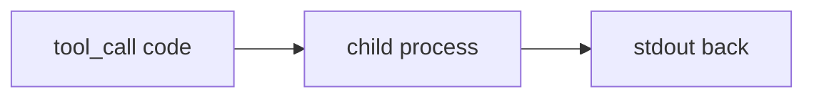

# 09: Sandbox

After this page untrusted code runs in a subprocess (or container) with limits, not in the agent process.

## Data
- Isolation: `subprocess` / Docker / Wasm
- Limits: CPU, memory, no host FS except a work dir
- Lab: `lab1_code_sandbox`

## Information
The model emits code. Your process must not `exec` it in-process.

## Knowledge
1. Write the snippet to a temp file or stdin.
2. Run it in a child with a timeout.
3. Return stdout/stderr only.

## Wisdom
In-process `eval` is not a sandbox.

## The When and Why
- **When:** the model can emit a shell command.
- **Why:** a bad command in the agent PID is your machine.

## How it works

## Data contract
Return: `{ "stdout": "string", "stderr": "string", "exit_code": 0 }`.

## Lab
- [lab1_code_sandbox.py](./lab1_code_sandbox.py) / [lab1_code_sandbox.md](./lab1_code_sandbox.md)

## Related
- **Docker / gVisor / Wasm:** same job, stronger wall.

## Notes
Keep the existing lab facts and mermaid from the moved file.
