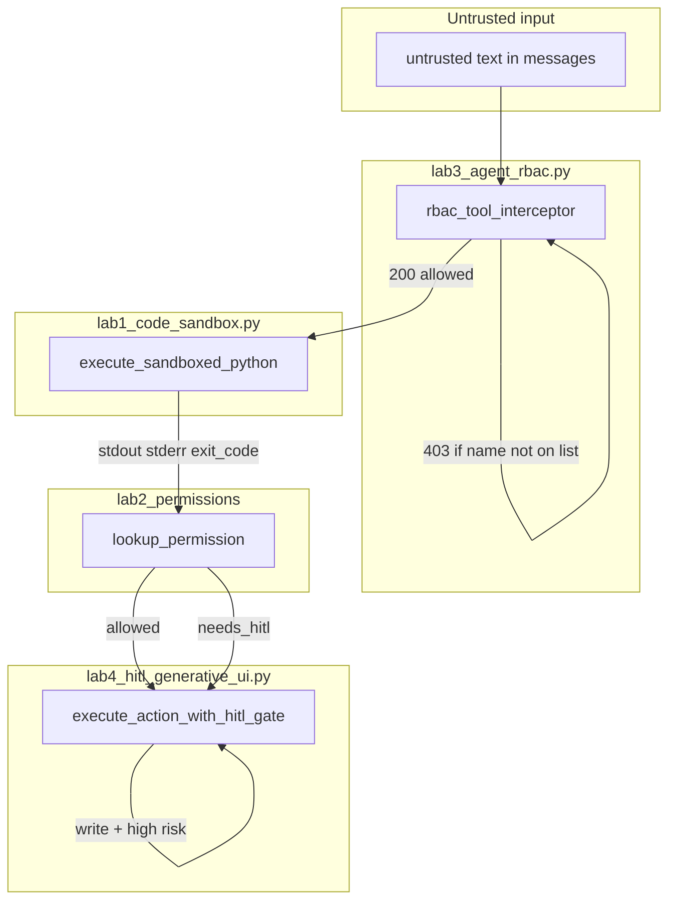

# 09: Security overview

After this page you can name injection, redaction, and least privilege as separate controls. Sandbox, the high-risk allowlist, RBAC, and HITL are the scripts in this folder. They are not the same control.

## Data
**Prompt injection** is untrusted text inside `messages`. Tool output, a user file, or a web page can contain instructions that the model treats as its job. That is a string problem in the prompt. There is no injection lab in this folder.

**Redaction** is stripping secrets before they enter the prompt or the logs. An API key in `stdout` must not be appended as `role: tool`. There is no redaction lab in this folder.

**Least privilege** is the smallest tool list for a role. Chapter 08 named the grant. `lab3_agent_rbac.py` stores it as `ROLE_TOOL_PERMISSIONS` and enforces it in `rbac_tool_interceptor`.

**Sandbox** is `execute_sandboxed_python` in `lab1_code_sandbox.py`. It stops code from running in the agent PID.

**Allowlist** is `TOOL_HIGH_RISK` in lab 2. A dict from tool name to a `high_risk` bool. `lookup_permission` returns `{ "allowed": true }` or `{ "needs_hitl": true, "tool": name }`. It does not call the tool. It sits after the sandbox and before lab 3 RBAC and lab 4 HITL.

**RBAC** is the role-to-tool list. A name not on the list returns status `403` and the function does not run.

**HITL** is a pause before a write. `AgentHITLEngine.execute_action_with_hitl_gate` in `lab4_hitl_generative_ui.py` checks `is_high_risk`. If true, it stores a checkpoint and returns a pause object. `resume_agent_execution` continues after a human `decision`.

This chapter's labs do not POST to Ollama. `OLLAMA_HOST` should still default to `http://127.0.0.1:11434` and `OLLAMA_MODEL` to `llama3.2:1b` when a tool later calls the model.

## Information
Sandbox stops code. The allowlist names which tools must pause. RBAC stops the wrong tool. HITL stops the write you did not approve. Injection is a string problem in the prompt. Redaction is a string problem before the prompt. One control is not the others.

A writer that is sandboxed can still call `run_command` if RBAC is missing. An allowed `write_file` can still run if HITL is missing. A paused write can still leak a key if redaction is missing.

## Knowledge
1. Treat tool output and user files as untrusted text. Do not append them as instructions.
2. Grant the smallest tool list. Store it as `dict[str, list[str]]`.
3. Run model-emitted code in `execute_sandboxed_python`, not with `eval`.
4. Look up `TOOL_HIGH_RISK` with `lookup_permission` before a write. Destructive names (`apply_db_migration`, `run_command`, `write_file`) return `{ "needs_hitl": true, "tool": name }`.
5. Use the existing scripts. Do not invent a new red-team lab.

## Wisdom
Do not invent a new red-team lab. Use the existing scripts. A WAF or input filter is the same job in front of HTTP and is not this chapter. Chapter 10 is the socket that can stream the HITL pause to a browser.

## The When and Why
- **When:** a tool can change the host or leak a secret.
- **Why:** one control is not the others. Sandbox, the allowlist, RBAC, and HITL fail in different places.

## How it works



Walkthrough of the scripts:

1. A `tool_calls` name arrives. `rbac_tool_interceptor("ARCHITECT", "run_command", ...)` looks up `ROLE_TOOL_PERMISSIONS`. `run_command` is not on the Architect list, so the return is `{ "status": 403, "error": "..." }` and the function does not run.
2. An allowed code-exec tool would call `execute_sandboxed_python`. The snippet runs in a child. The parent reads `stdout`, `stderr`, and `exit_code`.
3. `lookup_permission("apply_db_migration")` reads `TOOL_HIGH_RISK` and returns `{ "needs_hitl": true, "tool": "apply_db_migration" }`. It does not call the tool.
4. A write named `apply_db_migration` with `is_high_risk=True` hits `execute_action_with_hitl_gate`. The engine stores a checkpoint, emits an SDUI frame, and returns `{ "status": "PAUSED", "approval_id", "sdui_frame" }`. `resume_agent_execution(approval_id, "APPROVED")` continues.

The new fact is separate checks. Skipping one does not do the job of the others.

## Data contract

**Lab 2 lookup**

```json
{ "allowed": true }
```

or

```json
{ "needs_hitl": true, "tool": "apply_db_migration" }
```

**Intended HITL pause**

```json
{
  "action": "approval_required",
  "tool": "string",
  "args": {}
}
```

**What `lab4_hitl_generative_ui.py` actually returns** on a high-risk call

```json
{
  "status": "PAUSED",
  "approval_id": "appr-1",
  "sdui_frame": {
    "type": "GENERATIVE_UI_FRAME",
    "component": "HITLApprovalModal",
    "props": {
      "approval_id": "appr-1",
      "action": "apply_db_migration",
      "proposed_changes": {}
    }
  }
}
```

**Intended RBAC deny**

```json
{
  "error": "Execution rejected by policy engine"
}
```

**What `lab3_agent_rbac.py` actually returns** on deny: `{ "status": 403, "error": "Permission Denied: ..." }`. On allow: `{ "status": 200, "result": "string" }`.

See Notes.

## Lab
Done when you can name which script stops code, which names a high-risk tool, which stops the wrong tool, and which pauses a write.

- Module: [this file](./01_security_overview.md)
- Lab 1: [lab1_code_sandbox.py](./lab1_code_sandbox.py) / [lab1_code_sandbox.md](./lab1_code_sandbox.md) - child process. Covered on the sandbox page.
- Lab 2: [lab2_permissions.md](./lab2_permissions.md) - write `lab2_permissions.py`. `TOOL_HIGH_RISK` plus `lookup_permission`. Done when `read_file` is `{ "allowed": true }` and `apply_db_migration` is `{ "needs_hitl": true, "tool": "apply_db_migration" }`.
- Lab 3 RBAC: [lab3_agent_rbac.py](./lab3_agent_rbac.py) / [lab3_agent_rbac.md](./lab3_agent_rbac.md) - `rbac_tool_interceptor`. Done when Architect `run_command` is `403`.
- Lab 4 HITL: [lab4_hitl_generative_ui.py](./lab4_hitl_generative_ui.py) / [lab4_hitl_generative_ui.md](./lab4_hitl_generative_ui.md) - `execute_action_with_hitl_gate` then `resume_agent_execution`. Done when a high-risk action returns `PAUSED` and resume prints `RESUMED_SUCCESS`.

## Related
- **WAF / input filter:** same job in front of HTTP. Not in the labs.
- **00_sandbox.md:** the child-process control.
- **Chapter 08 roles:** the grant list this chapter enforces.
- **Chapter 10:** the socket that can stream the HITL pause to a browser.

## Notes
- Moved from modules/15. No new advanced topics.
- Contract drift vs lab 3 RBAC and lab 4 HITL: HITL does not return `{ "action": "approval_required" }`. It returns `{ "status": "PAUSED", "approval_id", "sdui_frame" }`. RBAC does not return `{ "error": "Execution rejected by policy engine" }`. It returns `{ "status": 403, "error": "Permission Denied: ..." }`. Neither script POSTs. Neither reads `OLLAMA_HOST`. The intended teaching objects stay on this page. Write those in your copy. Leave the reference files as-is.
- Lab 2 has no reference `.py` yet. Write `lab2_permissions.py` next to the brief.
