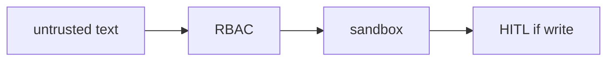

# 09: Security overview

After this page you can name injection, redaction, and least privilege as separate controls.

## Data
- Prompt injection: untrusted text inside `messages`
- Redaction: strip secrets before they enter the prompt or logs
- RBAC: role → tool list (lab 3)
- HITL: pause before a write (lab hitl)

## Information
Sandbox stops code. RBAC stops the wrong tool. HITL stops the write you did not approve. Injection is a string problem in the prompt.

## Knowledge
1. Treat tool output and user files as untrusted.
2. Grant the smallest tool list.
3. Require a human flag for destructive names.

## Wisdom
Do not invent a new red-team lab. Use the three existing scripts.

## The When and Why
- **When:** a tool can change the host or leak a secret.
- **Why:** one control is not the others.

## How it works

## Data contract
HITL event: `{ "action": "approval_required", "tool": "string", "args": {} }`.

## Lab
- [lab3_agent_rbac.py](./lab3_agent_rbac.py) / [lab3_agent_rbac.md](./lab3_agent_rbac.md)
- [lab3_hitl_generative_ui.py](./lab3_hitl_generative_ui.py) / [lab3_hitl_generative_ui.md](./lab3_hitl_generative_ui.md)

## Related
- **WAF / input filter:** same job in front of HTTP.

## Notes
Moved from modules/15. No new advanced topics.
