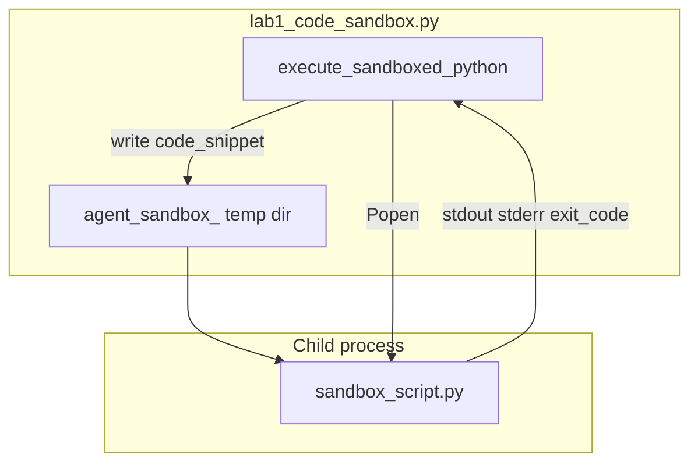

# Lab 1: Code sandbox

Model-requested code ran outside the agent process.

## What you touch
- Script: `lab1_code_sandbox.py`
- Function: `execute_sandboxed_python(code_snippet, timeout_seconds=5.0)`
- Temp dir: `tempfile.TemporaryDirectory(prefix="agent_sandbox_")`
- Child file: `sandbox_script.py` inside that dir
- Child start: `subprocess.Popen([sys.executable, script_path], cwd=temp_dir, stdout=PIPE, stderr=PIPE)`
- Wait: `process.communicate(timeout=timeout_seconds)`. On timeout, `process.kill()`
- Return keys: `status`, `exit_code`, `stdout`, `stderr`, `duration_seconds`
- Three snippets in `__main__`: valid `15 * 3` print, `data[10]` IndexError, `while True` loop with `timeout_seconds=2.0`
- This script does not POST. Env defaults still apply to the rest of the chapter: `OLLAMA_HOST` `http://192.168.1.29:11434`, `OLLAMA_MODEL` `qwen3.6:35b-a3b-65k`

## Steps


1. Write `execute_sandboxed_python`. Create a `TemporaryDirectory` with prefix `agent_sandbox_`. Write `code_snippet` to `sandbox_script.py` in that dir.
2. Start `[sys.executable, script_path]` with `cwd` set to the temp dir. Capture stdout and stderr as text.
3. Call `communicate(timeout=timeout_seconds)`. Default timeout is `5.0`. On `subprocess.TimeoutExpired`, `kill` the child and return `status` `TIMEOUT_EXCEEDED`, `exit_code` `-1`.
4. On a normal finish, set `status` to `COMPLETED` if `exit_code` is 0, else `FAILED`. Put stripped stdout and stderr in the return dict. Include `duration_seconds`.
5. In `__main__`, run three calls: the `15 * 3` print, the `data[10]` IndexError, and the infinite loop with `timeout_seconds=2.0`. Print each return dict.
6. Confirm you see `COMPLETED`, `FAILED`, and `TIMEOUT_EXCEEDED`. Do not `eval` the string in-process. Do not add Docker or gVisor.

## Data contract
Intended keys this lab should return. The reference file adds two more (Notes).

**Intended return**

```json
{
  "stdout": "string",
  "stderr": "string",
  "exit_code": 0
}
```

**Reference script return**

```json
{
  "status": "COMPLETED",
  "exit_code": 0,
  "stdout": "string",
  "stderr": "string",
  "duration_seconds": 0.0
}
```

`status` is `COMPLETED`, `FAILED`, or `TIMEOUT_EXCEEDED`.

## Run
From the repo root:

```bash
python education/09_the_shield/lab1_code_sandbox.py
```

```powershell
$env:OLLAMA_HOST="http://192.168.1.29:11434"
$env:OLLAMA_MODEL="qwen3.6:35b-a3b-65k"
python education/09_the_shield/lab1_code_sandbox.py
```

The reference script does not read those env vars and does not POST. They are listed so the Run block matches the other chapters.

## What you should see
`=== STARTING SUBPROCESS CODE EXECUTION SANDBOX LAB ===`. Test 1 prints `Result: 45` and `status` `COMPLETED`, `exit_code` 0. Test 2 prints an `IndexError` traceback in `stderr` and `status` `FAILED`. Test 3 prints `[TIMEOUT] [SANDBOX ALERT] Timeout Exceeded (2.0s)!` and `status` `TIMEOUT_EXCEEDED`, `exit_code` `-1`. If the loop never dies, `communicate` was called without a timeout or `kill` did not run.

## Stop here
Do not add Docker, gVisor, Wasm, a network namespace, or a seccomp profile. Do not `eval` in-process. Chapter 15 can call this function from the harness. Lab 3 RBAC and Lab 3 HITL are separate controls.

## Notes
- Keep the three tests: valid print, `IndexError`, infinite loop.
- Contract drift vs `lab1_code_sandbox.py`: return object adds `status` and `duration_seconds`. No `OLLAMA_HOST` / `OLLAMA_MODEL`. No CPU or memory cgroup. The child can still open the network; isolation is a temp `cwd` and a timeout. The intended contract is a child process that returns text and an exit code. Write that in your copy. Do not edit the `.py` in the repo.
