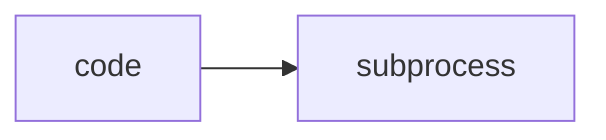

# Lab 1: Code sandbox

After this lab model-requested code ran outside the agent process.

## Data
- Script: `lab1_code_sandbox.py`

## Information
Child process in, stdout out.

## Knowledge
1. Receive a code string.
2. Run with timeout.
3. Print stdout and exit code.

## Wisdom
Not a full gVisor lab.

## The When and Why
- **When:** the model emits code.
- **Why:** in-process exec is the host.

## How it works



## Data contract
`{stdout, stderr, exit_code}`

## Run

```bash
python education/09_the_shield/lab1_code_sandbox.py
```

## What you should see
A printed exit code and captured stdout. A timeout kills the child.

## What this becomes later
Chapter 15 uses this inside the harness.

## Related
- **subprocess:** the primitive.

## Notes
Keep real-run notes from the old lab file when present.
