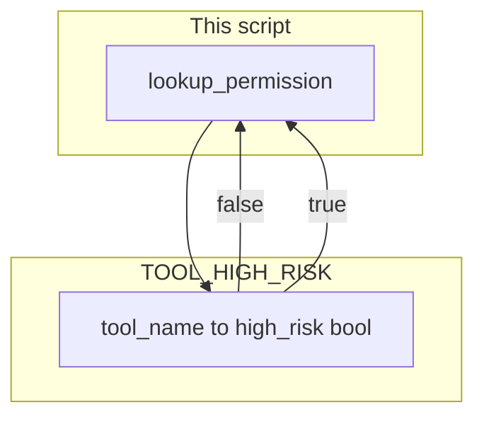

# Lab 2: Permissions allowlist

A dict from tool name to `high_risk` decides `{ "allowed": true }` or `{ "needs_hitl": true, "tool": name }`. The function does not call the tool.

## What you touch
- Script: `lab2_permissions.py` (write it next to this brief; there is no reference `.py` yet)
- Map: `TOOL_HIGH_RISK` (`dict[str, bool]`) from tool name to `high_risk`
- Function: `lookup_permission(tool_name)`
- Reference names: `read_file` false, `write_file` true, `run_command` true, `apply_db_migration` true
- Four lookups in `__main__`: those four names, print each return dict
- No HTTP. This script does not read `OLLAMA_HOST` or `OLLAMA_MODEL`.
- No UI. Do not call the tool. Do not open a browser.

## Steps


1. Write `TOOL_HIGH_RISK` as `{ "read_file": False, "write_file": True, "run_command": True, "apply_db_migration": True }`.
2. Write `lookup_permission(tool_name)`. Look up `high_risk = TOOL_HIGH_RISK.get(tool_name, True)`. If `high_risk` is false, return `{ "allowed": True }`. If true, return `{ "needs_hitl": True, "tool": tool_name }`.
3. Do not call a tool function. Do not import `rbac_tool_interceptor` or `AgentHITLEngine`. Do not build a modal.
4. In `__main__`, call `lookup_permission` on `read_file`, `write_file`, `run_command`, and `apply_db_migration`. Print each name and the return dict.
5. Confirm `read_file` is allowed and the other three need HITL. This lab sits after [lab1_code_sandbox.md](./lab1_code_sandbox.md) and before [lab3_agent_rbac.md](./lab3_agent_rbac.md) and [lab4_hitl_generative_ui.md](./lab4_hitl_generative_ui.md).

## Data contract
Only the keys this script writes and reads.

**Map**

```json
{
  "read_file": false,
  "write_file": true,
  "run_command": true,
  "apply_db_migration": true
}
```

**Allowed** (`high_risk` false)

```json
{ "allowed": true }
```

**Needs HITL** (`high_risk` true, or name missing from the map)

```json
{ "needs_hitl": true, "tool": "apply_db_migration" }
```

The function does not return a tool result. It does not return `status` 200 or 403. Those are lab 3 RBAC.

## Run
From the repo root:

```bash
python education/09_the_shield/lab2_permissions.py
```

```powershell
python education/09_the_shield/lab2_permissions.py
```

This script does not read `OLLAMA_HOST` or `OLLAMA_MODEL`. Do not set those vars for this lab. There is no HTTP call.

## What you should see
`read_file` prints `{ "allowed": true }`. `write_file`, `run_command`, and `apply_db_migration` each print `{ "needs_hitl": true, "tool": "..." }`. If a high-risk name prints `allowed`, the bool in the map is wrong. If you see `403`, `PAUSED`, or a child-process `stdout`, you opened the wrong lab.

## Stop here
This is not RBAC and not a HITL gate. Do not call the tool. Do not build a React modal. Do not start a WebSocket. Next: [lab3_agent_rbac.md](./lab3_agent_rbac.md).

## Notes
- Write `lab2_permissions.py` next to this brief. There is no reference `.py` in the repo yet.
- A missing name is treated as `high_risk` true so a new tool does not run free.
- Keys written and read match this brief. Do not edit other `.py` files in the repo.
- [lab3_agent_rbac.md](./lab3_agent_rbac.md) enforces the role list. [lab4_hitl_generative_ui.md](./lab4_hitl_generative_ui.md) pauses a write. Chapter 10 is the socket.
