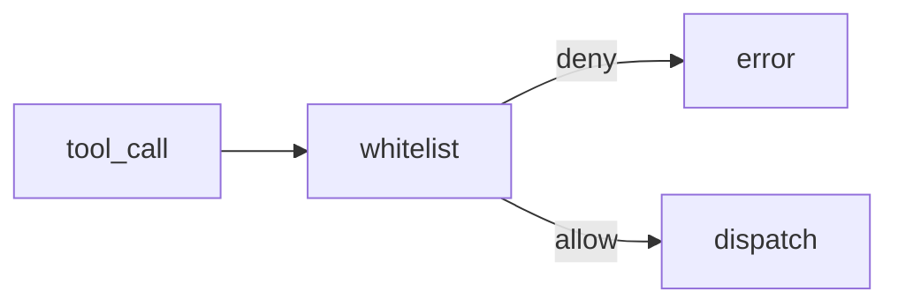

# Lab 3: Agent RBAC

After this lab a tool call not on the role list is rejected.

## Data
- Script: `lab3_agent_rbac.py`
- Map: role → tool names

## Information
Middleware checks the name before dispatch.

## Knowledge
1. Define a whitelist.
2. Attempt an allowed call and a denied call.
3. Denied call does not run.

## Wisdom
Persona text is not enough.

## The When and Why
- **When:** two roles share a process.
- **Why:** the list is the control.

## How it works



## Data contract
Deny: `{ "error": "Execution rejected by policy engine" }`

## Run

```bash
python education/09_the_shield/lab3_agent_rbac.py
```

## What you should see
One allowed result and one reject.

## What this becomes later
HITL lab adds a human gate on top.

## Related
- **Chapter 08 roles:** the list this lab enforces.

## Notes

