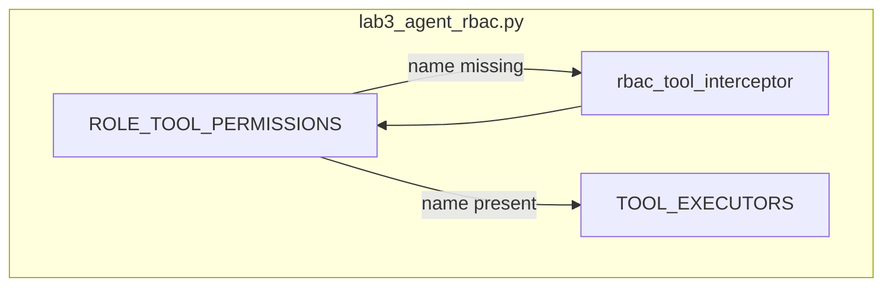

# Lab 3: Agent RBAC

A tool call not on the role list is rejected.

## What you touch
- Script: `lab3_agent_rbac.py`
- Map: `ROLE_TOOL_PERMISSIONS` (`dict[str, list[str]]`)
- Function: `rbac_tool_interceptor(agent_role, tool_name, tool_args)`
- Mock executors: `mock_read_file`, `mock_write_file`, `mock_run_tests`, `mock_run_command` in `TOOL_EXECUTORS`
- Reference grants: `ARCHITECT` → `read_file`, `list_dir`; `DEVELOPER` → `read_file`, `write_file`; `AUDITOR` → `read_file`, `run_tests`
- Four calls in `__main__`: Architect `read_file` (allow), Architect `run_command` (deny), Developer `write_file` (allow), Developer `run_tests` (deny)
- This script does not POST. Env defaults still apply to the rest of the chapter: `OLLAMA_HOST` `http://192.168.1.29:11434`, `OLLAMA_MODEL` `qwen3.6:35b-a3b-65k`

## Steps


1. Write `ROLE_TOOL_PERMISSIONS` as a dict from role name to a list of tool name strings. The reference keys are `ARCHITECT`, `DEVELOPER`, `AUDITOR`.
2. Write mock functions for `read_file`, `write_file`, `run_tests`, and `run_command`. Put them in `TOOL_EXECUTORS`.
3. Write `rbac_tool_interceptor(agent_role, tool_name, tool_args)`. Look up `allowed_tools = ROLE_TOOL_PERMISSIONS.get(agent_role, [])`. If `tool_name` is not in that list, return `{ "status": 403, "error": "..." }` and do not call the executor.
4. If the name is on the list, call `TOOL_EXECUTORS[tool_name](**tool_args)` and return `{ "status": 200, "result": "..." }`.
5. In `__main__`, run the four calls: Architect `read_file` on `architecture.md`, Architect `run_command` with `rm -rf /`, Developer `write_file` on `main.py`, Developer `run_tests` with `pytest`. Print each return dict.
6. Confirm one allow and one deny per role you test. The denied function must not run. Do not add a model POST, Docker, or a HITL pause.

## Data contract
Intended keys this lab should return. The reference file differs (Notes).

**Intended deny**

```json
{
  "error": "Execution rejected by policy engine"
}
```

**Intended allow**

```json
{
  "result": "string"
}
```

**Reference script deny**

```json
{
  "status": 403,
  "error": "Permission Denied: Role 'ARCHITECT' cannot execute tool 'run_command'."
}
```

**Reference script allow**

```json
{
  "status": 200,
  "result": "Content of file 'architecture.md'"
}
```

## Run
From the repo root:

```bash
python education/09_the_shield/lab3_agent_rbac.py
```

```powershell
$env:OLLAMA_HOST="http://192.168.1.29:11434"
$env:OLLAMA_MODEL="qwen3.6:35b-a3b-65k"
python education/09_the_shield/lab3_agent_rbac.py
```

The reference script does not read those env vars and does not POST. They are listed so the Run block matches the other chapters.

## What you should see
`=== STARTING AGENT ROLE-BASED ACCESS CONTROL (RBAC) LAB ===`. Architect `read_file` prints `[GRANTED]` and `status` 200. Architect `run_command` prints `[DENIED] PERMISSION DENIED (HTTP 403 Forbidden)` and `status` 403. Developer `write_file` is 200. Developer `run_tests` is 403. If `run_command` prints `Executed bash command`, the interceptor did not check the list.

## Stop here
Do not add a model POST, a sandbox, or a HITL pause. Persona text is not enough; the list is the control. The HITL lab in this folder is a different file also named lab3. Chapter 08 named the grant. This lab enforces it.

## Notes
- `run_command` exists in `TOOL_EXECUTORS` but is on no grant, so every role that calls it gets 403.
- Contract drift vs `lab3_agent_rbac.py`: deny is `{ "status": 403, "error": "Permission Denied: ..." }`, not `{ "error": "Execution rejected by policy engine" }`. Allow includes `status` 200. Role keys are uppercase. Tool names are `read_file`, `list_dir`, `write_file`, `run_tests`, not the chapter 08 teaching names (`view_file`, `write_spec`, `write_to_file`). No POST. The intended teaching deny is a rejected call that does not run the function. Write that in your copy. Do not edit the `.py` in the repo.
