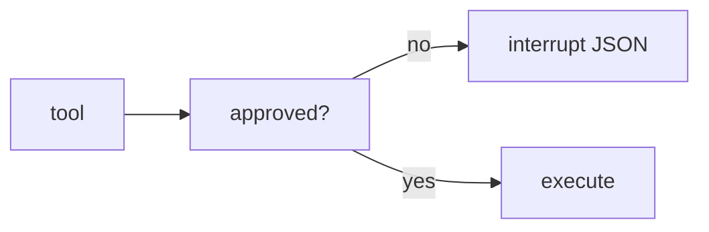

# Lab 3: HITL gate

After this lab a write does not run until an approval flag is set.

## Data
- Script: `lab3_hitl_generative_ui.py`

## Information
State holds `is_approved`. If false, interrupt.

## Knowledge
1. Attempt a destructive tool.
2. See the interrupt payload.
3. Set approved and resume.

## Wisdom
This is not a full React UI. Chapter 10 is the socket.

## The When and Why
- **When:** the tool would send mail or delete a row.
- **Why:** a loop without a pause cannot wait for a human.

## How it works



## Data contract
`{ "action": "approval_required", "payload": {} }`

## Run

```bash
python education/09_the_shield/lab3_hitl_generative_ui.py
```

## What you should see
An interrupt object, then a resume after approval.

## What this becomes later
Chapter 10 streams that object to a browser.

## Related
- **Chapter 05 checkpoint:** how you pause.

## Notes

