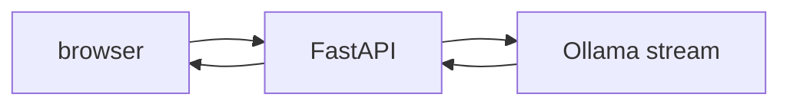

# 10: FastAPI and SSE

After this page the UI is a client of the script. The script is a server.

## Data
- FastAPI routes, SSE `text/event-stream`
- Lab: `lab1_sse_streaming_api`
- Frames: `data: ...\n\n`

## Information
Chapter 01 streamed to stdout. This chapter streams to a browser.

## Knowledge
1. Expose a route.
2. Yield SSE lines from the model stream.
3. Client reads `EventSource`.

## Wisdom
Do not build a full Next app in the lab.

## The When and Why
- **When:** a person is watching tokens.
- **Why:** stdout is not a UI.

## How it works

## Data contract
SSE line: `data: {"token": "..."}\n\n`

## Lab
- [lab1_sse_streaming_api.py](./lab1_sse_streaming_api.py) / [lab1_sse_streaming_api.md](./lab1_sse_streaming_api.md)

## Related
- **WebSocket:** lab 2, for interrupts.

## Notes
Moved from modules/05/00.
