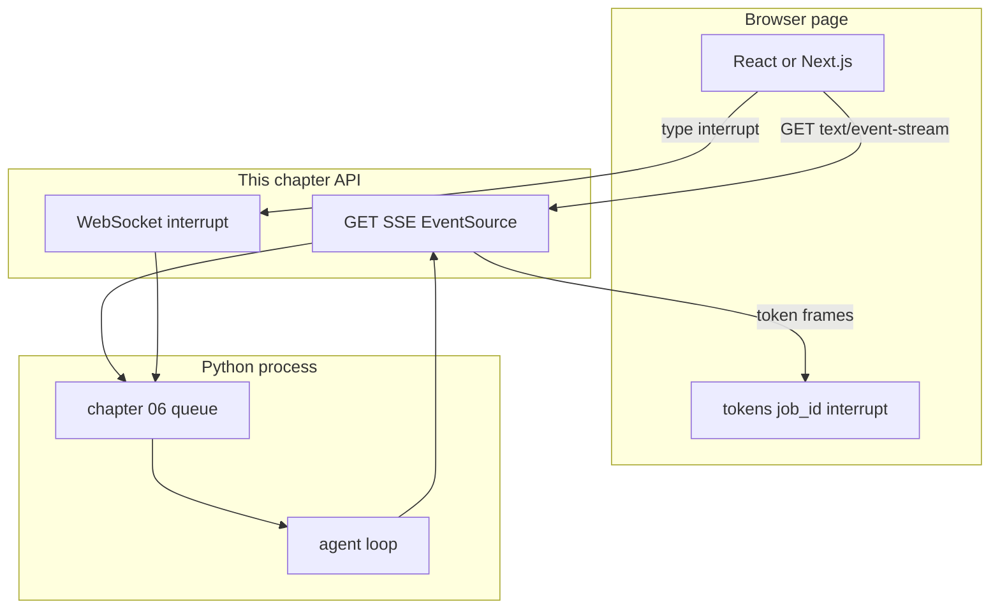

# 10: Frontend as a client

After this page React or Next.js is a client of the SSE or WebSocket API. The agent loop stays in Python. The lab is one HTML file that holds `tokens`, `job_id`, and a stop button.

## Data
A **frontend** here is a page that opens an HTTP stream and draws text. React and Next.js are two ways to build that page. The page is not the agent. Lab 3 is a single HTML file, not a Next.js app.

**UI state** on the page is three things:

- `tokens`: the string you append to as frames arrive.
- `job_id`: the id of the run you opened, so a second click does not mix two streams.
- `interrupt`: a flag or button that sends a stop message (lab 2).

The server is this chapter's routes plus the queue from chapter 06. The page does not own the queue.

`EventSource` reads SSE (`text/event-stream`) on a GET. A WebSocket (`new WebSocket`) is a two-way socket. Use SSE to watch tokens. Use the WebSocket when the button must send `{ "type": "interrupt" }`.

The intended start route is `POST /jobs` returning `{ "job_id": "string" }`. The intended SSE route is `GET /jobs/{job_id}/stream`. The intended WebSocket is `/jobs/{job_id}/ws`. Labs 1 and 2 do not serve those paths. Lab 3 writes the page and a proof script that reads the HTML. `OLLAMA_HOST` defaults to `http://192.168.1.29:11434`. `OLLAMA_MODEL` defaults to `qwen3.6:35b-a3b-65k`. Port `11434` is Ollama. The intended API port is `8000`.

## Information
The loop (ReAct, tools, retries) runs in Python. The page renders frames. If you put the loop in `useEffect`, a refresh kills the run and the contract is hidden inside React state.

`useEffect` is a React hook that runs after the page paints. It can open `EventSource`. It must not call the model or pick tools. Lab 3 uses `DOMContentLoaded` or a Start click for the same job.

## Knowledge
1. Open `EventSource` on the SSE route, or `new WebSocket` on the WS route.
2. On each message, parse the JSON. Append the token field to `tokens`.
3. Keep `job_id` from the first frame or from the POST that started the job.
4. On the stop button, send `{ "type": "interrupt" }` on the WebSocket. SSE cannot do this.
5. Do not put ReAct, tool dispatch, or the chapter 06 queue in `useEffect` or `DOMContentLoaded`.

## Wisdom
Stop when the page appends frames from the API. Do not move the loop into the browser. If you do, a bad token could come from React, from the socket, or from the model, and you will not know which.

## The When and Why
- **When:** you need a screen a person can watch.
- **Why:** mixing the loop into the page hides the contract. The contract is HTTP frames. The page is a client.

## How it works



Walkthrough of one turn on the page:

1. The page stores a `job_id` (from a start POST or from the first frame).
2. It opens `EventSource` on the stream route for that id.
3. Each `data:` line is JSON. The intended token key is `token`. Lab 1 uses `data.delta` inside a wrapper. Append the text to `tokens` and draw it.
4. If the person hits stop, the page cannot talk back on SSE. It sends `{ "type": "interrupt" }` on the WebSocket from lab 2.
5. The Python loop stops. The page shows the last tokens it already has.

The new fact is the page as a client. The loop did not move.

## Data contract

**Start POST**

```json
{ "prompt": "string" }
```

**Start response**

```json
{ "job_id": "string" }
```

**Intended token event** (what the page should read):

```json
{ "token": "string" }
```

**Intended interrupt** (what the stop button should send on the WebSocket):

```json
{ "type": "interrupt" }
```

Lab 1 wraps tokens as `{ "event_id", "event_type": "token_delta", "timestamp", "data": { "delta": "string" } }`. Lab 2 uses an `asyncio.Event`, not a real WebSocket frame. See Notes.

## Lab
Done when the proof script prints HAS EventSource, HAS tokens, HAS job_id, HAS interrupt, and NO for the generator, the graph, and `tool_calls`.

- Module: [this file](./01_frontend.md)
- Lab 1: [lab1_sse_streaming_api.md](./lab1_sse_streaming_api.md) — the outbound frames the page would read.
- Lab 2: [lab2_websocket_interrupt.md](./lab2_websocket_interrupt.md) — the inbound stop the button would send.
- Lab 3: [lab3_frontend_client.md](./lab3_frontend_client.md) — write `lab3_frontend_client.html` and `lab3_frontend_client.py`. EventSource, `tokens`, `job_id`, WebSocket `{ "type": "interrupt" }`. Done when the proof lines are HAS / HAS / HAS / HAS / NO / NO / NO.

## Related
- **Next.js:** same client job as React. The page still does not own the loop. Lab 3 does not use Next.js.
- **00_fastapi_sse.md:** the frames.
- **02_mx_vs_ux.md:** which frames the page should draw.

## Notes
- Keep the existing ideas: UI state is `tokens`, `job_id`, and an interrupt flag. The loop stays in Python. Do not put ReAct in `useEffect`.
- Lab 3 has no reference `.html` or `.py` yet. Contract drift lives on labs 1 and 2: lab 1 has no FastAPI route and uses `data.delta`; lab 2 has no WebSocket server. The intended page reads `{ "token": "string" }` and sends `{ "type": "interrupt" }`. Write the page in your copy. Do not edit the `.py` files in the repo.
- Moved from modules/05/01.
