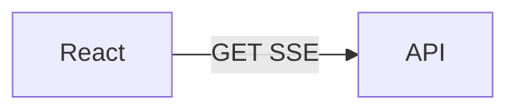

# 10: Frontend as a client

After this page React/Next is a client of the SSE/WebSocket API, not the place the agent loop lives.

## Data
- UI state: tokens, job_id, interrupt flag
- Server: chapter 06 queue + this chapter's routes

## Information
The loop stays in Python. The page renders frames.

## Knowledge
1. Open EventSource or WS.
2. Append tokens.
3. Send interrupt on button.

## Wisdom
Do not put ReAct in useEffect.

## The When and Why
- **When:** you need a screen.
- **Why:** mixing the loop into the page hides the contract.

## How it works

## Data contract
Token event: `{ "token": "string" }`

## Lab
See labs 1 and 2.

## Related
- **Next.js:** same client job.

## Notes
Moved from modules/05/01.
